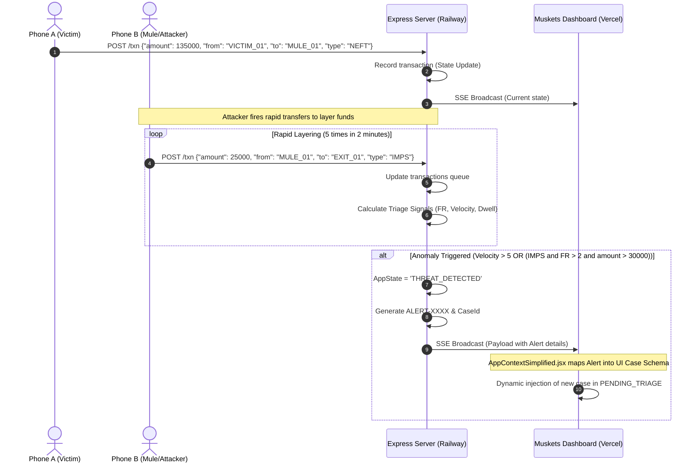
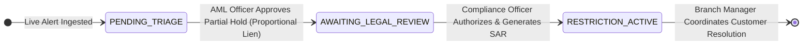

<div align="center">

# Muskets
### Post-Detection Containment and Operational Response Platform

> **Preserve legitimate customer activity while securing traced funds.**

**IOB Cybernova 2026 — Problem Statement 2: Advanced Controls for Mule Account Detection and AML Compliance**

[](https://muskets-containment-radar.vercel.app/)
[](https://muskets-mock.up.railway.app)
[](#)

[](https://react.dev/)
[](https://vitejs.dev/)
[](https://tailwindcss.com/)
[](LICENSE)

</div>

---

## Table of Contents
1. [The Problem Statement & Operational Challenge](#1-the-problem-statement--operational-challenge)
2. [Institutional Market Research & Data Benchmarking](#2-institutional-market-research--data-benchmarking)
3. [Triage Classification Engine](#3-triage-classification-engine)
4. [Threshold Calibration — Primary Institutional Sources](#4-threshold-calibration--primary-institutional-sources)
5. [System Architecture & End-to-End Flow](#5-system-architecture--end-to-end-flow)
6. [The 3-Step Role-Based Workflow](#6-the-3-step-role-based-workflow)
7. [Technical Implementation & Stack](#7-technical-implementation--stack)
8. [Setup & Demo Walkthrough (Live Transaction Ingestion)](#8-setup--demo-walkthrough-live-transaction-ingestion)
9. [Regulatory & Evidentiary Compliance Alignment](#9-regulatory--evidentiary-compliance-alignment)

---

## 1. The Problem Statement & Operational Challenge

### Hackathon Problem Statement Context
Mule accounts are the foundational infrastructure of modern financial cybercrime. Syndicate networks deploy thousands of rented or compromised accounts to receive stolen funds and immediately disperse them through automated layering chains. The **IOB Cybernova 2026 (Problem Statement 2: Advanced Controls for Mule Account Detection and AML Compliance)** calls for mechanisms that can identify these accounts and enforce swift containment actions while ensuring compliance with regulatory mandates.

### The Fatal Operational Gap: Detection vs. Containment
Existing bank systems focus heavily on **detection** (generating machine learning alerts, flagging VPN logins, identifying device mismatches). However, once an alert fires, banks suffer from a critical operational response gap:
- **Blanket Freezes:** Current core banking controls only support binary actions — freezing the entire account (100% of funds) or doing nothing.
- **Collateral Damage on Merchants:** If a legitimate merchant unknowingly receives a small fraction of stolen funds (e.g. ₹50,000) inside a large active business account (e.g. ₹30,00,000), a blanket freeze paralyzes their business. This creates second-order victims out of honest citizens.
- **Delayed Timelines:** Coordinated action between investigators, legal review officers, and branch managers is fragmented across multiple siloed software systems, taking hours or days during which the fraudsters withdraw the funds.

**Muskets** is a **Post-Detection Triage and Operational Response Platform**. It does not perform the initial fraud detection. Instead, it ingests alerts (such as from a detection engine like *MuleHunter*), classifies their severity, recommends a **Proportional Restriction (Lien)**, and orchestrates the response across the AML, Legal, and Branch units in real-time.

---

## 2. Institutional Market Research & Data Benchmarking

To build a defensible, production-grade system, Muskets calibrates its triage signals against primary datasets published by Indian institutional authorities rather than synthetic models.

### Key Data Insights

#### FIU-IND (Financial Intelligence Unit - India) Annual Reports
- **Commercial Banking Burden:** Scheduled commercial banks file over **85% of all Suspicious Transaction Reports (STRs)** in India.
- **Volume Surge:** STR filings have grown YoY at a rate exceeding **35%**, driven by the ubiquity of UPI, creating massive backlogs for manual compliance teams.

#### RBI (Reserve Bank of India) Annual Report & Trend & Progress of Banking
- **Digital Fraud Dominance:** Digital fraud (card/internet banking/UPI) represents over **80% of total fraud occurrences** by volume.
- **Low Recovery Rates:** The recovery rate for digital cyber frauds is under **8%** globally and in India, primarily because funds are layered out within minutes.
- **Velocity Thresholds:** 99th percentile UPI usage stands at **2.3 transactions per minute** under normal usage. Anything above **10 transactions per minute** represents anomalous script-driven behaviour.

#### FATF (Financial Action Task Force) Mutual Evaluation Report — India (2024)
- **Immediate Outcome 7 & 9 (Asset Recovery & Financial Intelligence):** Ground evidence from Indian enforcement cases shows that syndicate mule accounts display a **fund dwell time of sub-3 minutes** before money is dispersed or withdrawn. Immediate containment (within minutes) is critical to asset recovery.

#### Judicial Precedent on Blanket Freezes (Delhi High Court)
- In multiple landmark rulings (e.g. *Dr. Shashi Kumar v. State*), the Delhi High Court criticized the police and commercial banks for freezing 100% of business accounts over minor disputed transactions. The court ruled that **only the disputed/tainted amount should be restricted** to preserve the account holder's livelihood. This legal mandate serves as the core foundation for the Muskets **Proportional Lien Model**.

---

## 3. Triage Classification Engine

Muskets uses deterministic, verifiable arithmetic to score and triage incoming alerts. There are no black-box models or weight inferences, ensuring that the evidence is **legally defensible** in court.

### Triage Signal 1: Ingress Anomaly Magnitude (Z-Score)
```
Z = (x - μ) / σ
```
- `x`: Current transaction amount.
- `μ`: Historical mean transaction amount for the receiving account.
- `σ`: Historical standard deviation.
- **Operational Trigger:** $|Z| > 3.0$ indicates a 3-sigma deviation, flagging the transaction as mathematically anomalous for this specific customer.

### Triage Signal 2: Layering Intensity Score (Fragmentation Ratio)
```
FR = outbound_splits_within_10_minutes / historical_daily_average_splits
```
- **Operational Trigger:** $FR > 3.0$ indicates the account is acting as a "smurfing" node, immediately splitting incoming transfers into smaller fractions.

### Triage Signal 3: Relay Speed Index (Propagation Velocity)
```
Velocity = outbound_transactions / time_window_minutes
```
- **Operational Trigger:** $> 10$ transactions per minute confirms automated script execution.

### Triage Signal 4: Fund Retention Duration (Dwell Time)
```
Dwell Time = timestamp_of_first_outbound - timestamp_of_incoming_transfer
```
- **Operational Trigger:** $< 5$ minutes (High suspicion), $< 2$ minutes (Critical relay action).

---

## 4. Threshold Calibration — Primary Institutional Sources

Triage signal thresholds in Muskets are mapped directly to documented banking baseline statistics:

| Signal | Threshold | Calibration Basis | Primary Source |
|:---|:---|:---|:---|
| **Fragmentation Ratio** | $FR > 3.0$ | Retail accounts average 0.4–0.6 outbound splits/day; $FR > 3.0$ represents 5–7x normal daily splits executed in minutes. | *NPCI Payment Statistics* |
| **Velocity Index** | $> 10\text{ tx/min}$ | 99th percentile UPI usage is 2.3 tx/min; 10 tx/min represents a 4.3x population upper bound, indicating automated scripting. | *RBI Payment Systems Report* |
| **Dwell Time** | $< 5\text{ minutes}$ | Confirmed mule accounts in Indian enforcement cases exhibit sub-3-minute fund retention windows before layered transfer. | *FATF Mutual Evaluation India September 2024, IO-7* |
| **Priority P1** | $> \text{₹1,00,000 traced}$ | Trigger threshold for mandatory Suspicious Transaction Report (STR) filing under Prevention of Money Laundering Act guidelines. | *RBI Master Direction KYC, Para 38(ii)* |

---

## 5. System Architecture & End-to-End Flow

Muskets implements a live-streaming mock transaction loop using an Express server and Server-Sent Events (SSE). This setup allows multiple remote client devices (simulating victims and mules) to submit transaction payloads and watch the admin dashboard state change in real-time.

### Architectural Diagram
```
  Simulated Devices                      Mock Backend (Railway)                      Frontend (Vercel)
         │                                         │                                         │
  Phone A (Victim) ──── POST /txn ───────────────►│                                         │
         │                                         │                                         │
  Phone B (Mule)   ──── POST /txn (Rapid Fire) ──►│ ─── Server-Sent Events (SSE) /events ──►│ (In-memory State)
         │                                         │                                         │
  Admin Simulator  ──── POST /reset ─────────────►│                                         │
```

### End-to-End Sequence Flow


---

## 6. The 3-Step Role-Based Workflow

Muskets divides the post-detection lifecycle across three specialized workspaces using a unified state machine:



### 1. AML Compliance Officer Workspace
- **Action:** Reviews incoming alert queues. The dashboard shows real-time elapsed timers, risk amounts, and the visual fund lineage graph.
- **Lien Recommendation:** Shows a side-by-side comparison of **Full Freeze** (destroying business operations) vs. **Proportional Lien** (only locking the traced amount).
- **Outcome:** The officer approves the lien, forwarding the case to the legal review queue.

### 2. Legal & Principal Officer Workspace
- **Action:** Reviews the legally binding timeline of events.
- **Reporting:** Generates the **Suspicious Activity Report (SAR)** PDF with a secure SHA-256 integrity hash, and exports the **DPIP Interbank Packet** for coordination with other banks.
- **Outcome:** Authorizes the containment action, locking the funds in the core banking ledger.

### 3. Branch Manager Workspace
- **Action:** Interacts with the flagged customer walking into the branch.
- **Continuity:** Displays a simple, non-technical bar chart showing locked funds (amber) vs. free funds (green).
- **Resolution:** Collects verification documents (invoices, tax declarations) and escalates them back to central compliance if the transaction is verified as legitimate.

---

## 7. Technical Implementation & Stack

### Frontend (Single Page App)
- **UI & State:** React 19 + Vite 8. Lightweight context-based state synchronization in [AppContextSimplified.jsx](file:///D:/IOB/frontend/src/context/AppContextSimplified.jsx) enables reactive updates upon receiving SSE alerts.
- **Fund Lineage Visuals:** `react-force-graph-2d` renders real-time force-directed topologies of the transaction trails.
- **Transitions:** `framer-motion` animates workspace routing and card additions.
- **Evidence Generation:** `jsPDF` and `jsPDF-AutoTable` generate tamper-proof PDF reports client-side.

### Backend (Express Server)
- **Routing:** Node.js Express server running on Railway.
- **Communication:** `EventEmitter` bus handles internal events. `/events` serves a Server-Sent Events (SSE) data stream providing real-time state changes to connected browsers.
- **Endpoints:**
  - `POST /txn`: Endpoint for simulated banking apps or mobile devices to post transaction payloads.
  - `GET /state`: REST endpoint returning the current transaction log and alert queues.
  - `GET /events`: SSE endpoint streaming real-time alerts.
  - `POST /reset`: Resets the backend state back to default configuration.

---

## 8. Setup & Demo Walkthrough (Live Transaction Ingestion)

### 1. Start the Mock Backend
Navigate to the `backend` folder, install the express dependency, and start the node server.
```bash
cd backend
npm install
npm start
```
The mock backend will start running on port `3001` (or the environment assigned port).

### 2. Start the Frontend
In a separate terminal, navigate to the `frontend` folder, install dependencies, and launch the Vite dev server.
```bash
cd frontend
npm install
npm run dev
```
Open `http://localhost:5173` in your browser.

### 3. Live Demo: Simulating a Mule Transaction Flow
Open your terminal and run the following commands to simulate transaction logs.

#### Step A: victim sends ₹50,000 to the mule
```bash
curl -X POST https://muskets-mock.up.railway.app/txn \
  -H "Content-Type: application/json" \
  -d "{\"amount\":50000,\"from\":\"VICTIM_01\",\"to\":\"MULE_01\",\"type\":\"NEFT\"}"
```

#### Step B: Attacker executes rapid structuring/layering
Run this command 5 times rapidly within 2 minutes to simulate automated transfer scripts splitting funds.
```bash
curl -X POST https://muskets-mock.up.railway.app/txn \
  -H "Content-Type: application/json" \
  -d "{\"amount\":12000,\"from\":\"MULE_01\",\"to\":\"EXIT_01\",\"type\":\"IMPS\"}"
```

#### Step C: Watch the Dashboard
As the velocity exceeds the calibrated threshold ($>5$ splits/2min), the backend transitions `appState` to `THREAT_DETECTED`, generates a new alert, and streams it to the frontend via SSE. The Muskets dashboard will automatically inject the new case at the top of the **AML Officer's** queue in real-time.

---

## 9. Regulatory & Evidentiary Compliance Alignment

Muskets is aligned with the latest regulatory mandates of the Indian financial ecosystem:

- **Bharatiya Sakshya Adhiniyam (BSA) 2023, Section 63:**
  Evidence must be admissible in court as primary electronic records. Muskets generates pre-compiled timelines using primary raw timestamps and amounts, avoiding algorithmic bias or weights. The generated SAR PDFs are accompanied by an immutable SHA-256 hash to prevent tampering.
  
- **PMLA (Prevention of Money Laundering Act), Section 12AA:**
  Requires financial institutions to verify customer identities and execute enhanced security checks. Muskets' proportional lien secures suspect funds under Section 12AA without violating the account owner's fundamental right to carry on trade.
  
- **RBI Fraud Risk Management Directions 2024:**
  Mandates structured timelines, audit logs, and prompt filing of SARs (within 7 days of fraud classification). Muskets automates the reporting data pre-assembly, reducing SAR creation time from 4 hours to 1 click.
