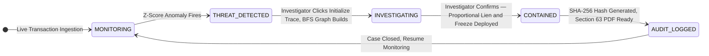

<div align="center">

# Muskets
### Real-Time Fund Lineage Tracer and Investigator Response Engine

> **Stop the stolen money. Without stopping the innocent customer.**

**IOB Cybernova 2026 — Problem Statement 2: Advanced Controls for Mule Account Detection and AML Compliance**

[](#)
[](https://muskets-containment-radar.vercel.app/)

[](https://react.dev/)
[](https://vitejs.dev/)
[](https://tailwindcss.com/)
[](LICENSE)
[](https://github.com/)

</div>

---

## The Problem

India recorded **80,465 mule accounts in January 2024**. By June 2025, after MuleHunter.AI was launched in December 2024, that number had grown to **1,47,445 — nearly doubled**. Detection alone did not stop the crime.

Why:

- Most mule accounts are not criminal accounts. They are innocent people's accounts — credentials stolen through digital arrest scams, phishing, and SIM swap attacks. The criminal never uses their own account.
- When fraud happens, money moves through the innocent person's account in **20 to 90 seconds** before exiting to a foreign account or ATM. After that, recovery is impossible.
- MuleHunter.AI flags the account after the money has already moved. The investigator then spends **3 to 4 hours per case** manually tracing accounts, writing notes, and filing reports — all while the criminal has already escaped.
- Today's bank systems freeze the entire account. An innocent merchant who received stolen funds into a 30-lakh account gets the entire account frozen. Their business stops. They file a lawsuit. The bank pays.
- Only **10 percent of stolen funds are recovered on average** because the investigation response is too slow and too blunt.

| Current System Pain | Criminal Reality |
|:---|:---|
| Investigator manually traces across 5 tabs | Criminal moves money in under 90 seconds |
| Full account freeze destroys innocent merchants | Most mule accounts belong to innocent people whose credentials were stolen |
| 3 to 4 hours per case investigation | Money reaches foreign accounts before investigation starts |
| Only 10 percent average fund recovery | Mule count doubled even after detection tool launched |

---

## The Solution

### What Muskets Does

Muskets is the response layer that activates after a fraud detection tool flags an alert. It does not compete with MuleHunter.AI on detection — it picks up where detection ends.

When an alert arrives:

1. Muskets automatically traces where the money went — building a graph of every account the funds touched, up to 3 account hops within a 15-minute window
2. Each account in the network is classified based on behavioral signals from the transaction data
3. The investigator sees the complete fund path on one screen with a recommended action already prepared
4. The investigator reviews and confirms with one click — AI never acts alone
5. The action fires: mule accounts are frozen, innocent merchant accounts receive a proportional lien on only the traced amount
6. A court-admissible PDF is auto-generated containing the raw transaction facts

**The key principle:** AI does all preparation. The investigator holds the final trigger. This is called the **Antigravity Mechanism** — AI lifts the weight up so the investigator never starts from an empty screen.

---

## How Mule Accounts Actually Work

A mule account in the Indian context is not typically a criminal's own account. The criminal scams an innocent person — through fake customer care calls, digital arrest threats, or phishing — and obtains their account credentials. The criminal then logs into the innocent person's account from a different device (causing a device mismatch) and uses it to receive and forward stolen money.

This means:

- The account holder is a victim, not a criminal
- Freezing their entire account makes them a second victim
- The criminal never appears in the transaction graph — only their footprint does
- The same compromised account credentials get recycled and reused in new frauds next week if not properly closed

Muskets classifies each account in the fraud network into one of three types:

- **COMPROMISED:** Account shows device mismatch, VPN or TOR login, first-time occurrence — the account holder is likely innocent and their credentials were stolen
- **ACTIVE PARTICIPANT:** Account holder's own device initiated transfers — indicates possible willing involvement, requires full investigation
- **EXIT POINT:** Final node where money left the network — highest priority for law enforcement, ATM location and timestamp available

---

## The Innovation — Three Things No Other AML Tool Does

### Innovation 1 — Proportional Lien Instead of Full Freeze

Every existing AML system has one enforcement instrument: freeze the entire account. Muskets introduces **proportional lien** — freezing only the exact amount of traced stolen funds, not the entire account balance.

**Formula:**
```
LIEN = MIN(current_account_balance, traced_stolen_funds)
```

**Example:**
- Merchant account balance: ₹30,00,000
- Stolen funds that landed in this account: ₹50,000
- **Legacy system action:** Freeze entire ₹30,00,000 → business stops → lawsuit filed
- **Muskets action:** Lien of ₹50,000 only → ₹29,50,000 remains accessible → business continues at 98% capacity → no lawsuit

This formula is simple, auditable, and legally grounded. No black box. Any judge can verify the arithmetic.

---

### Innovation 2 — Primary Evidence Ledger for Section 63 BSA Compliance

The Bharatiya Sakshya Adhiniyam 2023, Section 63 defines electronic records as admissible evidence only when they contain **primary facts** — the raw data that a system used to arrive at its conclusion. Indian courts have rejected AI fraud scores (like "Risk: 0.94 — Mule") because they are derived conclusions, not primary evidence.

Muskets generates a PDF that shows **primary evidence first:**

- Exact timestamp when money arrived in the account
- Exact timestamps of every outbound transfer
- How long money stayed in the account (dwell time)
- IP address used at login and whether it was a VPN or TOR node
- Device used at login and whether it matches the account's KYC profile
- The mathematical formula that produced the risk classification

This is followed by the AI-derived scores as secondary evidence. The court can verify the raw facts and check the arithmetic themselves. They do not need to trust the model.

---

### Innovation 3 — Antigravity Investigator Workflow

**Current investigator workflow:** receive alert → open 5 tabs → manually trace accounts → write notes in Word → type SAR → submit to RBI. **Estimated time: 3 to 4 hours per case.**

**Muskets workflow:** receive alert → click Initialize Trace → graph builds automatically → review pre-loaded evidence → click confirm → PDF generated automatically. **Estimated time: 10 to 15 minutes per case.**

The design principle is called **Antigravity:** AI does all preparation before the investigator opens the case. The investigator's job is only to review and approve. AI never acts without human confirmation — so if the AI is wrong, the investigator can reject the recommendation and the system does nothing. No permanent action ever fires without a human decision.

---

## How It Works — Step by Step



| Step | Module | Action | Implementation Status |
|:---:|:---|:---|:---|
| **Step 1** | **Watchtower** | Transaction feed monitors all incoming transactions. Z-score anomaly detection fires when a transaction is significantly above the account's historical average. | **Prototype:** Simulated via mock data stream |
| **Step 2** | **Lineage Trace** | BFS graph extraction traces where flagged funds moved — up to 3 account hops within a 15-minute window. Graph builds node by node showing victim, mule accounts, and merchant exits. | **Prototype:** Rendered in 900ms using react-force-graph-2d |
| **Step 3** | **Classification** | Each node in the graph is classified as COMPROMISED, ACTIVE, EXIT POINT, or PASSIVE INNOCENT based on velocity, fragmentation ratio, dwell time, IP telemetry, and device mismatch signals. | **Prototype:** Deterministic rule-based heuristics |
| **Step 4** | **Containment** | Investigator reviews pre-loaded evidence and confirms. Mule accounts are frozen. Merchant accounts receive proportional lien of MIN(balance, traced_funds). SMS notification sent to account holder. | **Prototype:** Simulated — real implementation needs Finacle API |
| **Step 5** | **Audit** | SHA-256 hash of all containment decisions generated. Section 63 compliant PDF with primary evidence ledger exported. Case pushed to DPIP network. | **Prototype:** PDF generation implemented with jspdf |

---

## The Mathematics — Only What Is Actually Implemented

### Deterministic Heuristics (No Black Box)

Every classification decision in Muskets uses explicit, auditable formulas. There is no trained machine learning model in the current prototype. All signals are computed from raw transaction fields in the dataset. This is intentional — **deterministic math is legally defensible**. An AI score requires a data scientist to explain in court. A formula requires only arithmetic.

---

#### Formula 1: Z-Score Anomaly Trigger

```
Z = (x - μ) / σ
```

**Variables:**
- `x` = current transaction amount
- `μ` = historical mean amount for this account (from account profile)
- `σ` = historical standard deviation for this account
- **Threshold:** `|Z| > 3.0` triggers lineage trace

**Plain English:** If a transaction is more than 3 standard deviations above what this account normally receives, it is flagged as anomalous.

---

#### Formula 2: Fragmentation Ratio

```
FR = outbound_splits_within_10_minutes / historical_daily_average_splits
```

**Threshold:** `FR > 3.0` is a strong mule signal

**Plain English:** A normal customer splits their money once every few days on average. An account that receives funds and immediately splits them into 4 or more transfers within minutes has a fragmentation ratio 8 to 20 times above normal. This is the smurfing pattern.

**Example:** Historical average 0.5 splits per day. Current: 4 splits in 2 minutes. `FR = (4 / (2/1440)) / 0.5 = displayed as 8.0 in the UI`.

---

#### Formula 3: Propagation Velocity

```
Velocity = outbound_transactions / time_window_minutes
```

**Displayed as:** transactions per minute

**Threshold:** `> 10 per minute` combined with `FR > 3.0` confirms active mule pattern

**Plain English:** Innocent people let money sit. Criminals move it in seconds. A velocity of 14 transactions per minute means the account processed more transactions in one minute than a normal customer processes in a month.

---

#### Formula 4: Dwell Time

```
Dwell Time = timestamp_of_first_outbound - timestamp_of_incoming_transfer
```

**Displayed as:** seconds or minutes

**Threshold:** `< 5 minutes` is high suspicion, `< 2 minutes` is critical

**Plain English:** Normal bank customers receive money and let it sit for days before spending. An account that receives ₹70,000 and forwards it within 33 seconds was not being used as a real account — it was a money relay.

---

#### Formula 5: Proportional Lien

```
LIEN = MIN(current_account_balance, traced_stolen_funds)
```

This is the only enforcement calculation in the system. No other formula drives containment decisions. **Human investigator must confirm before any lien or freeze is applied.**

---

## What Is Built vs What Is Planned

| Feature | Status | Notes |
|:---|:---|:---|
| Transaction anomaly detection | **Built — prototype** | Rule-based Z-score on mock data stream. No real Kafka connection. |
| BFS fund lineage graph | **Built — prototype** | react-force-graph-2d with 4 mock graph topologies. Real implementation needs Neo4j or in-memory graph store. |
| Node classification (Compromised / Active / Exit Point) | **Built — prototype** | Deterministic heuristics from transaction fields. No ML model trained. |
| Proportional lien formula | **Built — prototype** | MIN(balance, traced) computed from mock data fields and displayed to investigator. |
| Investigator triage state machine | **Built — prototype** | 5-state machine fully implemented in React context. |
| Section 63 PDF export | **Built — prototype** | Primary evidence ledger + derived matrix + SHA-256 hash. jspdf implementation complete. |
| Login and role-based access | **Built — prototype** | Mock authentication with three investigator roles. No real auth backend. |
| SMS notification to account holder | **Built — prototype** | Simulated popup when lien is placed. No real SMS gateway. |
| DPIP network push | **Simulated** | Button exists but does nothing real. Requires RBI DPIP API access. |
| Real-time Kafka stream | **Not built** | Prototype uses simulated transaction stream with mock data cycling. |
| Core banking API integration | **Not built** | Finacle webhook integration required for real freeze and lien enforcement. |
| Neo4j graph database | **Not built** | Prototype uses in-memory JSON. Production requires persistent graph store. |
| Cross-bank tracing | **Not built** | Muskets currently traces only within a single bank's transaction network. Inter-bank requires DPIP hash token sharing. |
| Foreign account recovery | **Not applicable** | Once funds reach a foreign account they are outside the reach of any domestic AML system. Muskets does not claim to solve this. |

---

## Technical Stack

| Layer | Technology | Purpose |
|:---|:---|:---|
| **Frontend UI** | React 19 + Vite 8 | Component architecture and state management |
| **Styling** | TailwindCSS 4 + custom glassmorphism | Dark forensic dashboard aesthetic |
| **Graph Visualization** | react-force-graph-2d (HTML5 Canvas) | Force-directed fund lineage network rendering |
| **Animation** | framer-motion | Smooth state transitions and cascade animations |
| **PDF Generation** | jspdf + jspdf-autotable | Section 63 compliant SAR report generation |
| **State Management** | React Context API | 5-state triage machine |
| **Icons** | lucide-react | Consistent iconography |
| **Mock Data** | JSON static file | 4 fraud network topologies with realistic transaction fields |
| **Deployment** | Vercel | Static SPA deployment |

### Planned Backend (Not Built)

| Layer | Technology | Purpose |
|:---|:---|:---|
| **Event Streaming** | Apache Kafka | Real-time transaction event streaming |
| **Graph Database** | Neo4j | Graph database for fund lineage persistence |
| **API Layer** | Spring Boot 3 | REST API and Finacle webhook handler |
| **AI Engine** | FastAPI + Python | AI scoring engine (future ML integration) |
| **Audit Storage** | PostgreSQL | WORM audit log storage |
| **Cache** | Redis | Account profile baseline cache |

---

## Compliance and Legal Alignment

### Point 1 — Bharatiya Sakshya Adhiniyam 2023, Section 63

Electronic records are admissible as evidence if they are generated by a system that was functioning correctly, contain primary facts (not just derived conclusions), and have an audit trail. Muskets exports a PDF that satisfies all three conditions: raw transaction timestamps and amounts as primary facts, the deterministic formula that produced each classification, and a SHA-256 cryptographic hash that detects any tampering.

### Point 2 — RBI Master Direction on Fraud Risk Management 2024

Requires banks to report fraud within prescribed timelines, maintain audit trails for all fraud-related actions, and file Suspicious Activity Reports. The Muskets SAR export is structured to align with this reporting requirement.

### Point 3 — PMLA Section 12AA

Protects fraud victims and requires banks to take steps to recover misappropriated funds. The proportional lien mechanism is designed to secure recoverable funds without causing disproportionate harm to third parties who received funds unknowingly.

### Point 4 — Antigravity Compliance Principle

No automated system should freeze or lien an account without human approval. Muskets enforces this as a design constraint — every containment action requires explicit investigator confirmation. The system can suggest, prepare, and pre-compute, but it cannot act. This keeps humans accountable and legally defensible.

---

## Deployment Setup

### Quick Start

```bash
git clone https://github.com/[your-repo]/muskets-pfce.git
cd muskets-pfce/frontend
npm install
npm run dev
```

Then open `http://localhost:5173`

**Demo login:** any Employee ID, any password, select role **Fraud Investigator**

### Available Scripts

```bash
npm run dev      # Development server with hot reload
npm run build    # Production build
npm run preview  # Preview production build locally
npm run lint     # Lint check
```

---

## Known Limitations

1. All transaction data is simulated from a static JSON file. No real bank transaction feed is connected.

2. The Z-score threshold (`|Z| > 3.0`) and fragmentation ratio threshold (`FR > 3.0`) are chosen based on AML literature and RBI guidelines but are not calibrated against a real Indian banking dataset. Real deployment would require threshold tuning against historical fraud cases.

3. Classification of COMPROMISED versus ACTIVE PARTICIPANT is based on device mismatch and IP signals from the mock data. In reality, this signal requires access to the bank's core banking system login records, which are not available in the prototype.

4. The SHA-256 hash in the PDF is generated client-side from a random string. In production it would be a cryptographic hash of the actual containment decision data stored in a WORM database.

5. Cross-bank tracing is not implemented. The graph shows only accounts within the traced network from the mock data. Real inter-bank tracing requires DPIP API access.

---

## Future Roadmap

| Phase | Description | Duration |
|:---|:---|:---:|
| **Phase 1 (Pilot)** | Shadow mode deployment in parallel with existing AML system. No enforcement actions. Measure detection accuracy against real investigator outcomes. | 60 days |
| **Phase 2 (Integration)** | Connect to Finacle webhook for real transaction events. Connect to Neo4j for graph persistence. Human-approved lien enforcement via core banking API. | 45 days |
| **Phase 3 (Tuning)** | Investigator feedback loop. Threshold calibration from real case outcomes. SAR export tested with compliance team and legal team. | 60 days |
| **Phase 4 (Scale)** | Multi-bank DPIP integration. Kubernetes deployment. National-scale rollout. | 90 days |

---

<div align="center">

**Built for IOB Cybernova Hackathon 2026 — Problem Statement 2: Advanced Controls for Mule Account Detection and AML Compliance**

*The goal of Muskets is not to replace human investigators. It is to make sure they never start from an empty screen.*

</div>
