<div align="center">

# 🔫 Muskets

### Post-Detection Containment & Operational Response Platform

> **Preserve legitimate customer activity while securing traced funds.**

**IOB Cybernova 2026 — Problem Statement 2: Advanced Controls for Mule Account Detection and AML Compliance**

[](https://muskets-containment-radar.vercel.app/)
[](https://muskets-mock.up.railway.app)
[](https://github.com/bhargava562/muskets-containment-radar/actions/workflows/ci.yml)
[](#)

[](https://spring.io/projects/spring-boot)
[](https://openjdk.org/)
[](https://react.dev/)
[](https://vitejs.dev/)
[](https://tailwindcss.com/)

</div>

---

## Table of Contents

1. [The Problem — Why Detection Alone Isn't Enough](#1-the-problem--why-detection-alone-isnt-enough)
2. [The Solution — Muskets Investigation Workspace](#2-the-solution--muskets-investigation-workspace)
3. [Screenshots](#3-screenshots)
4. [System Architecture](#4-system-architecture)
5. [Detection Engine — Triage Classification](#5-detection-engine--triage-classification)
6. [Threshold Calibration — Primary Institutional Sources](#6-threshold-calibration--primary-institutional-sources)
7. [The 3-Step Role-Based Workflow](#7-the-3-step-role-based-workflow)
8. [Technical Stack](#8-technical-stack)
9. [Setup & Development](#9-setup--development)
10. [Railway Deployment](#10-railway-deployment)
11. [Environment Variables](#11-environment-variables)
12. [Regulatory & Evidentiary Compliance](#12-regulatory--evidentiary-compliance)
13. [Research Evidence Base](#13-research-evidence-base)
14. [Documentation Index](#14-documentation-index)

---

## 1. The Problem — Why Detection Alone Isn't Enough

### Hackathon Context

Mule accounts are the foundational infrastructure of modern financial cybercrime. Syndicate networks deploy thousands of rented or compromised accounts to receive stolen funds and immediately disperse them through automated layering chains.

**MuleHunter.AI** — RBI's own machine-learning detection tool, built by RBIH — is live at 26+ scheduled commercial banks with 85%+ accuracy. It is free, government-backed, and solves detection.

**So why do banks still lose money?**

### The Fatal Operational Gap: Detection vs. Containment

> *"MuleHunter.AI finds bad accounts fast. Banks still cannot **act** on that information fast enough — because after the alert fires, there is no connected system, only a chain of disconnected manual steps that eats the small window of time available before the money disappears."*

| Problem | Impact |
|:---|:---|
| **Blanket Freezes** | Current CBS controls only support binary actions — freezing 100% of funds or doing nothing. A merchant unknowingly receiving ₹50,000 of stolen funds inside a ₹30,00,000 business account gets their entire business paralyzed. |
| **Fragmented Tools** | Investigators manually visit core banking, KYC records, transaction history, device logs, and complaint records — one at a time, in different systems. |
| **No Freeze SLA** | RBI's fraud governance pipeline has **no numeric SLA for freezing or containment**. Bank-generated alerts default to the slow track (weeks to 180 days). |
| **Judicial Backlash** | Courts have repeatedly struck down blanket freezes as disproportionate and unconstitutional (Article 19(1)(g), Article 21). |

### IOB-Specific Precedent

> **M/S S.A. Enterprises v. RBI** (Allahabad HC, 2026 LiveLaw (AB) 282) — Indian Overseas Bank was fined ₹50,000 for freezing a fisheries-machinery firm's account after a legitimate ₹23 lakh RTGS credit, with no formal complaint or investigating-authority order.
>
> Court's language: ***"Bank Can't Metamorphose Into Investigating Agency."***

This is IOB's own institution, penalized this year, for the precise problem Muskets addresses.

### The Five-Step Failure Chain

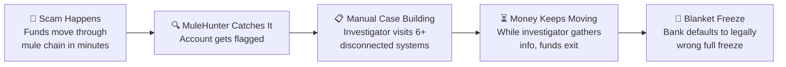

### Recovery Rate Crisis

| Metric | Figure |
|:---|:---|
| Amount stopped by CFCFRMS | ₹7,647 crore |
| Amount actually restored to victims | ₹167 crore (**2.18%**) |
| Total cyber-fraud losses (2024) | ₹22,845.73 crore (+206% YoY) |
| Mule accounts identified by I4C | 24.67 lakh |

---

## 2. The Solution — Muskets Investigation Workspace

### One-Sentence Solution

> **Muskets is an investigation workspace for post-detection fraud operations — it takes a MuleHunter-style alert and gives the investigator a single, pre-assembled case (account graph, evidence, recommended proportional action) instead of scattered systems, so a proportional lien can be decided and executed in minutes instead of hours.**

### Core Design Principle: "Antigravity"

**The AI should pre-prepare everything so the investigator never starts from an empty screen.**

Instead of an alert that just says `Risk Score: 91%`, Muskets assembles:

- ✅ Customer identity and account details
- ✅ Full traced transaction chain
- ✅ Connected-account graph (mules, merchants, victims)
- ✅ AI-generated evidence summary and reasoning
- ✅ **Side-by-side comparison** of Full Freeze vs. Proportional Lien
- ✅ Case timeline / audit trail
- ✅ Export paths: STR draft, Case Evidence Package

### Why a Graph?

Mule fraud is a **network crime**, not a list of isolated transactions. A table of transactions cannot reveal:
- Which account is the collection hub
- Which account is the distribution/fan-out point
- Shared devices, shared IPs, or circular fund movement

MuleHunter itself operates on graph-structured reasoning internally. Muskets surfaces that relational view to the human investigator.

### AI's Role: Assistant, Not Decision-Maker

At every containment decision point, the AI presents options — it does not act autonomously:

```
Possible next actions
✓ Request KYC verification
✓ Escalate to Compliance
✓ Recommend Partial Lien
✓ Draft STR
✓ Wait for additional information
```

The human always chooses. This matches RBI's regulatory framework for human sign-off and defuses the "black-box AI freezing my account" liability risk.

---

## 3. Screenshots

### Login — Role-Based Access

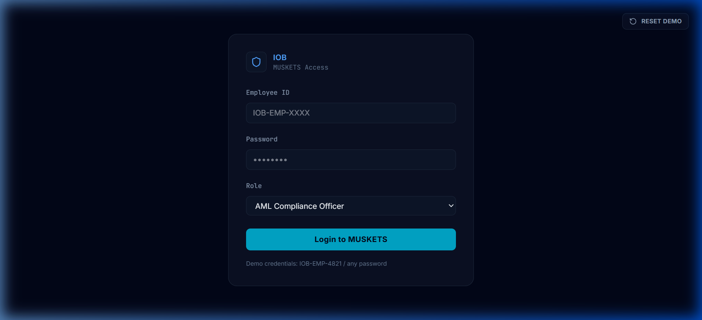

### Triage Operations Queue — Priority Alerts

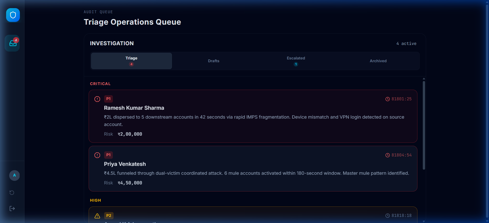

### Gateway Decision — Case Intake

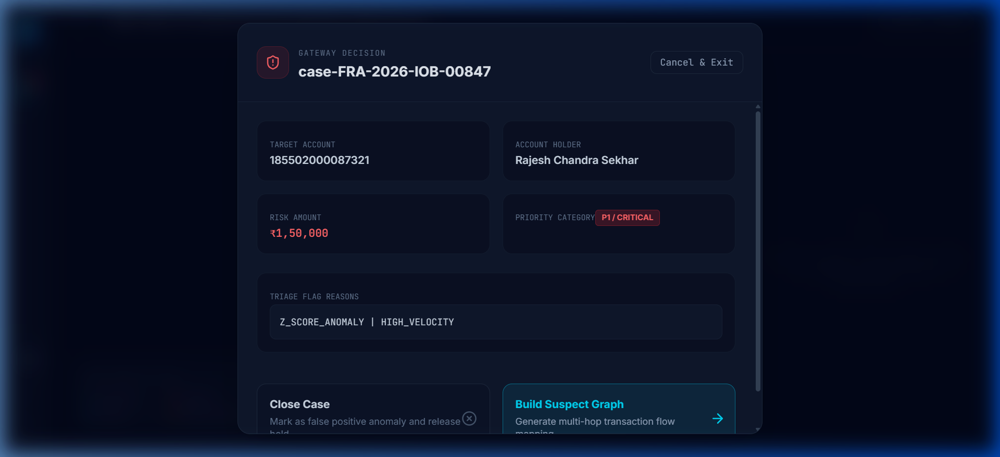

### Investigation Workcanvas — Suspect Graph + Node Inspector

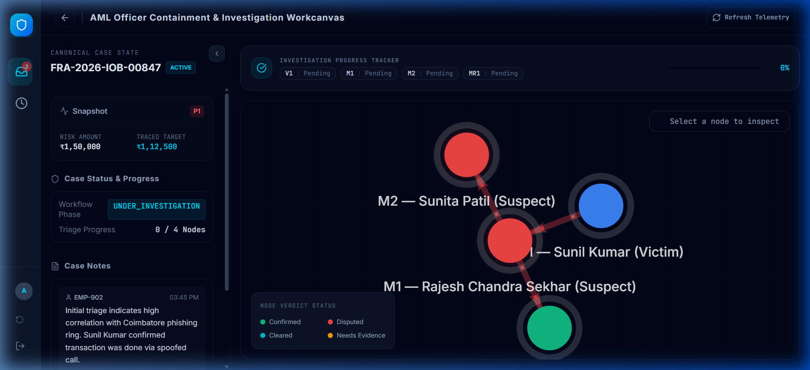

### Investigation Workcanvas — AI Copilot Assessment

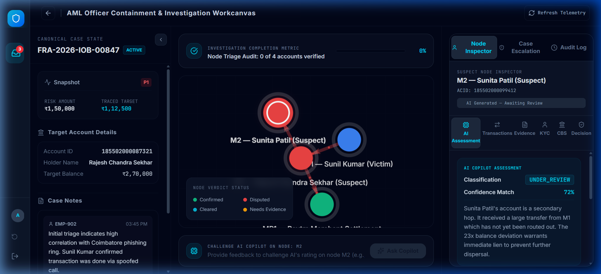

### Case Escalation — Progress-Gated Checklist

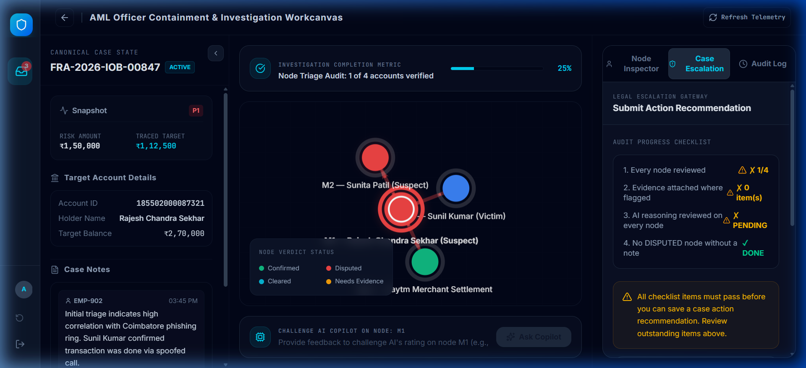

### Audit Logs — SIEM Activity Feed

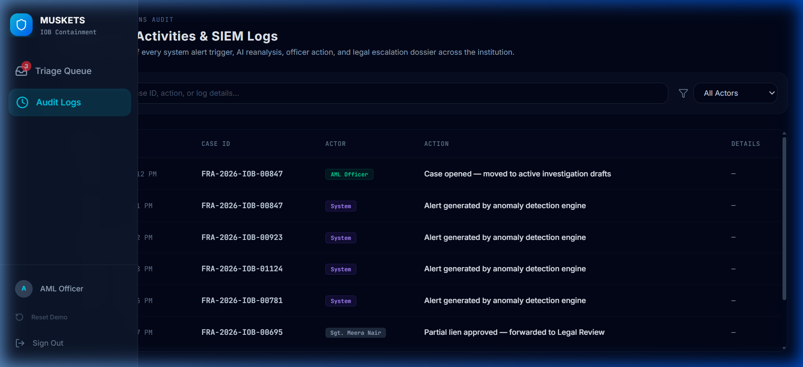

---

## 4. System Architecture

### High-Level Architecture

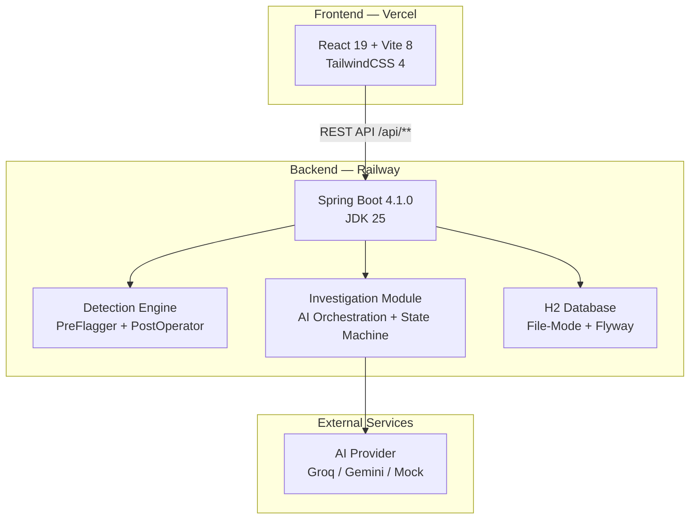

### End-to-End Investigation Flow

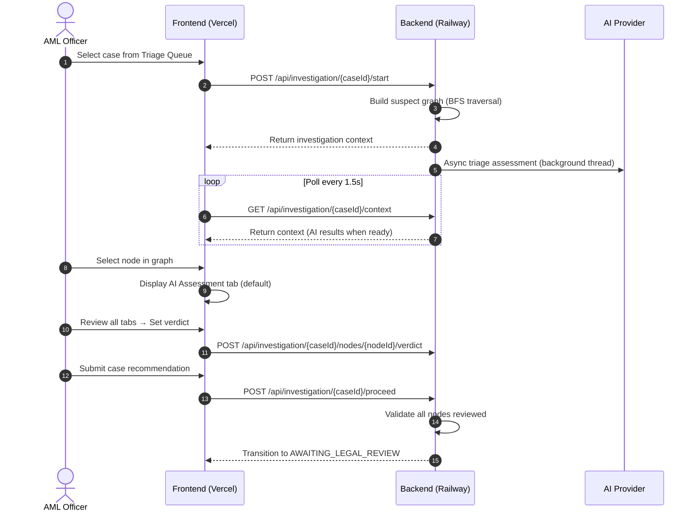

### Investigation State Machine

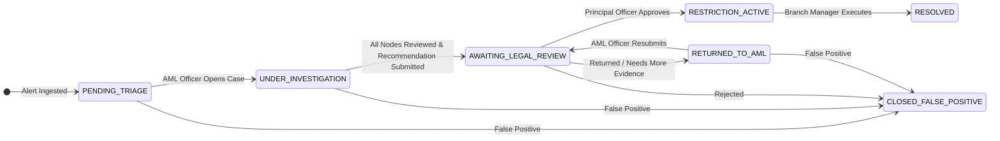

---

## 5. Detection Engine — Triage Classification

Muskets uses **deterministic, verifiable arithmetic** to score and triage incoming alerts. There are no black-box models or weight inferences, ensuring that the evidence is **legally defensible** in court.

### The Two-Speed Rule

| Engine | Speed | Purpose |
|:---|:---|:---|
| **PreFlagger** (Job 1) | O(1) per transaction | Streaming evaluation of every incoming transaction. Updates per-account state using incremental algorithms. Never queries the database. |
| **PostOperator** (Job 2) | On-demand BFS | Bounded graph traversal (max 4 hops, 48h window) when an analyst initiates investigation. Maps fund flow to downstream accounts. |

### Signal 1: Z-Score Anomaly (Welford's Algorithm)

Incrementally computes mean and variance without keeping history:

$$M_1 = x_1, \quad M_k = M_{k-1} + \frac{x_k - M_{k-1}}{k}, \quad S_k = S_{k-1} + (x_k - M_{k-1})(x_k - M_k)$$

Standard deviation: $\sigma = \sqrt{S_k / (k-1)}$

Self-calibrating Z-score: $Z = (x_k - \mu) / \sigma$

**Trigger:** $|Z| > 3.0$ (3-sigma deviation)

### Signal 2: Fragmentation Ratio (Layering Intensity)

```
FR = outbound_splits_within_10_minutes / historical_daily_average_splits
```

**Trigger:** $FR > 3.0$ — account acting as a "smurfing" node

### Signal 3: Relay Speed Index (Propagation Velocity)

```
Velocity = outbound_transactions / time_window_minutes
```

**Trigger:** $> 10$ transactions per minute — automated script execution

### Signal 4: Fund Retention Duration (Dwell Time)

```
Dwell Time = timestamp_of_first_outbound - timestamp_of_incoming_transfer
```

**Trigger:** $< 5$ minutes (High suspicion), $< 2$ minutes (Critical relay)

### Signal 5: Account-Age Risk Weight

Calculated once on first transaction using `ACCT_OPN_DATE`. Accounts opened less than 30 days prior receive an additional risk multiplier.

### Signal 6: Negative Balance Streak

Tracks consecutive transactions where `balance < 0`. A credit above zero resets the streak immediately.

---

## 6. Threshold Calibration — Primary Institutional Sources

All thresholds are calibrated against documented banking baseline statistics — not synthetic models:

| Signal | Threshold | Calibration Basis | Primary Source |
|:---|:---|:---|:---|
| **Z-Score Anomaly** | $\|Z\| > 3.0$ | Standard 3-sigma statistical anomaly, self-calibrated per account history | Statistical standard |
| **Fragmentation Ratio** | $FR > 3.0$ | Retail accounts average 0.4–0.6 outbound splits/day; $FR > 3.0$ = 5–7x normal | *NPCI Payment Statistics* |
| **Velocity Index** | $> 10\text{ tx/min}$ | 99th percentile UPI usage is 2.3 tx/min; 10 tx/min = 4.3x population upper bound | *RBI Payment Systems Report* |
| **Dwell Time** | $< 5\text{ min}$ | Confirmed mule accounts exhibit sub-3-minute fund retention before layered transfer | *FATF Mutual Evaluation India Sep 2024, IO-7* |
| **Priority P1** | $> \text{₹1,00,000 traced}$ | Mandatory STR filing trigger under PMLA guidelines | *RBI Master Direction KYC, Para 38(ii)* |
| **Account Age** | $< 30\text{ days}$ | New accounts used as disposable mule receivers | *RBI Fraud Risk Directions 2024* |

---

## 7. The 3-Step Role-Based Workflow

Three roles mirror real PMLA/RBI governance responsibilities:

### Step 1: AML Investigation Officer

| Aspect | Detail |
|:---|:---|
| **Input** | MuleHunter-style alert from triage queue |
| **Workspace** | Force-directed suspect graph, AI Copilot, Node Inspector (6 tabs) |
| **Tab Order** | AI Assessment → Transactions → Evidence → KYC → CBS → Decision |
| **Core Invariant** | Officer must see AI's claim and evidence before setting a verdict |
| **Output** | All nodes reviewed, recommendation submitted, case forwarded to legal |

**Node Inspector Tabs:**

| Tab | Purpose |
|:---|:---|
| AI Assessment | Classification, risk score, confidence match, model reasoning |
| Transactions | Chronological transaction ledger for the selected node |
| Evidence | AI provenance, system-generated records, officer uploads |
| KYC | Identity, mobile, occupation, customerSince, linked complaints |
| CBS | Account type, balance, nominee, lien status, last txn dates |
| Decision | Officer verdict + containment action (isolated from AI text) |

### Step 2: Principal Officer (Compliance)

| Aspect | Detail |
|:---|:---|
| **Input** | Reviewed case from AML Officer |
| **Actions** | Review investigation summary, generate AI-assisted STR draft, approve/return/reject |
| **STR Draft** | AI generates Indian banking terminology (STR, FIU-IND, PMLA, lien) narrative; officer can edit |
| **Decision Map** | APPROVE → `RESTRICTION_ACTIVE`, RETURN → `RETURNED_TO_AML`, REJECT → `CLOSED_FALSE_POSITIVE` |
| **Output** | Case Evidence Package PDF with SHA-256 integrity hash |

### Step 3: Branch Manager

| Aspect | Detail |
|:---|:---|
| **Input** | Approved restriction from Principal Officer |
| **Actions** | Contact customer, collect documents, execute restriction |
| **Restriction View** | Non-technical display: locked funds (amber) vs free funds (green) |
| **Execution** | `RESTRICTION_APPLIED` transitions case to `RESOLVED` |

---

## 8. Technical Stack

### Frontend (Vercel)

| Technology | Purpose |
|:---|:---|
| React 19 | Component framework |
| Vite 8 | Build tool & dev server |
| TailwindCSS 4 | Utility-first styling |
| react-force-graph-2d | Force-directed suspect graph visualization |
| framer-motion | Workspace routing & card animations |
| jsPDF + autoTable | Client-side PDF generation (STR, Evidence Package) |

### Backend (Railway)

| Technology | Purpose |
|:---|:---|
| Spring Boot 4.1.0 | Application framework |
| JDK 25 | Runtime |
| H2 (file-mode) | Embedded database with Flyway migrations |
| PostgreSQL driver | Included for future production database switch |
| Jackson 2.17.2 | JSON serialization |
| ArchUnit | Module boundary enforcement tests |

### AI Integration

| Provider | Model | Mode |
|:---|:---|:---|
| Groq (default) | llama-3.1-8b-instant | Production |
| Gemini | gemini-2.5-flash | Alternative |
| Mock | MockAiEvaluator | Offline / hackathon fallback |

---

## 9. Setup & Development

### Prerequisites

- **JDK 25** (Eclipse Temurin recommended)
- **Node.js 24+** (for frontend)

### Backend — Local Development

```bash
cd backend

# Run in development mode
./mvnw spring-boot:run

# Or build and run as JAR
./mvnw clean package -DskipTests
java -jar target/*.jar
```

Backend starts on `http://localhost:8080`.

### Frontend — Local Development

```bash
cd frontend

# Install dependencies
npm install

# Run dev server
npm run dev
```

Frontend starts on `http://localhost:5173`.

### Environment Variables (Local)

Create a `backend/.env` file:

```env
CORS_ALLOWED_ORIGINS=http://localhost:5173
GROQ_API_KEY=your_groq_api_key
AI_MODEL=llama-3.1-8b-instant
REANALYZE_RATE_LIMIT=200
```

---

## 10. Railway Deployment

The backend is configured for direct Railway deployment from GitHub — no Docker required.

### Steps

1. **Connect GitHub Repository** to Railway
2. **Set Root Directory** to `backend`
3. **Add Environment Variables:**

| Variable | Value |
|:---|:---|
| `CORS_ALLOWED_ORIGINS` | `https://muskets-containment-radar.vercel.app` |
| `GROQ_API_KEY` | Your Groq API key |
| `AI_MODEL` | `llama-3.1-8b-instant` |
| `REANALYZE_RATE_LIMIT` | `200` |

4. **Railway automatically:**
   - Detects Maven project
   - Runs `./mvnw clean package -DskipTests`
   - Injects `PORT` environment variable
   - Starts the JAR
   - Deploys on every push to `main`

### Frontend (Vercel)

The frontend is already deployed on Vercel at [`muskets-containment-radar.vercel.app`](https://muskets-containment-radar.vercel.app/). Vercel auto-deploys from the `frontend/` directory on push.

---

## 11. Environment Variables

| Variable | Default | Description |
|:---|:---|:---|
| `PORT` | `8080` | Server port (injected by Railway) |
| `CORS_ALLOWED_ORIGINS` | `http://localhost:5173` | Allowed CORS origins |
| `AI_PROVIDER` | `groq` | AI provider (`groq`, `gemini`, `mock`) |
| `GROQ_API_KEY` | `MOCK_KEY` | Groq API key |
| `AI_MODEL` | `llama-3.1-8b-instant` | AI model identifier |
| `REANALYZE_RATE_LIMIT` | `200` | Max AI reanalysis calls per day |
| `SPRING_DATASOURCE_URL` | `jdbc:h2:file:./data/muskets...` | Database connection URL |
| `SPRING_DATASOURCE_DRIVER_CLASS_NAME` | `org.h2.Driver` | JDBC driver class |
| `SPRING_DATASOURCE_USERNAME` | `sa` | Database username |
| `SPRING_DATASOURCE_PASSWORD` | *(empty)* | Database password |
| `SPRING_JPA_DATABASE_PLATFORM` | `org.hibernate.dialect.H2Dialect` | JPA dialect |

---

## 12. Regulatory & Evidentiary Compliance

### Bharatiya Sakshya Adhiniyam (BSA) 2023, Section 63

Evidence must be admissible in court as primary electronic records. Muskets generates pre-compiled timelines using primary raw timestamps and amounts, avoiding algorithmic bias or weights. Generated STR PDFs are accompanied by an immutable SHA-256 hash to prevent tampering.

### PMLA (Prevention of Money Laundering Act), Section 12AA

Requires financial institutions to verify customer identities and execute enhanced security checks. Muskets' proportional lien secures suspect funds under Section 12AA without violating the account owner's fundamental right to carry on trade.

### RBI Fraud Risk Management Directions 2024

Mandates structured timelines, audit logs, and prompt filing of STRs (within 7 days of fraud classification). Muskets automates reporting data pre-assembly, reducing STR creation time from 4 hours to 1 click.

### Key Judicial Precedents

| Case | Court | Ruling |
|:---|:---|:---|
| **M/S S.A. Enterprises v. RBI** | Allahabad HC, 2026 | IOB fined ₹50,000 for unauthorized freeze. *"Bank Can't Metamorphose Into Investigating Agency."* |
| **Malabar Gold v. Union of India** | Delhi HC, Jan 2026 | ₹80L frozen with no FIR against Malabar Gold; ruled "manifestly arbitrary" |
| **Neelkanth Pharma Logistics v. UOI** | Delhi HC, 2025 | Full freeze over ₹200 disputed credit. Court: *"Lien on disputed amount... should be the first and foremost option."* |
| **Vivek Varshney v. Union of India** | Supreme Court, Jan 2026 | SC noted absence of uniform national SOP for freezing/unfreezing accounts (pending) |

---

## 13. Research Evidence Base

All claims in this README are tiered by verification confidence:

| Tag | Meaning |
|:---|:---|
| 🟢 **VERIFIED** | Independently confirmed via primary source (court order, government PDF) |
| 🟡 **SOURCED** | Real citations, internally consistent, but primary source not re-fetched |
| 🔴 **EXCLUDED** | Searched for directly, no matching primary source found — removed from use |

See [`docs/03-RESEARCH-EVIDENCE.md`](docs/03-RESEARCH-EVIDENCE.md) for the complete evidence base with source tiers, including an explicit exclusion list of unverifiable citations.

---

## 14. Documentation Index

| Document | Description |
|:---|:---|
| [`01-PROBLEM-STATEMENT.md`](docs/01-PROBLEM-STATEMENT.md) | The operational gap, five-step failure chain, regulatory reality |
| [`02-SOLUTION.md`](docs/02-SOLUTION.md) | Product concept, design principles, three roles, business framing |
| [`03-RESEARCH-EVIDENCE.md`](docs/03-RESEARCH-EVIDENCE.md) | Every legal, regulatory, and statistical claim — source-tiered (🟢/🟡/🔴) |
| [`04-DETECTION-MODULE-IMPLEMENTATION.md`](docs/04-DETECTION-MODULE-IMPLEMENTATION.md) | Detection engine implementation, PreFlagger math, BFS tracing |
| [`05-AML-OFFICER-INVESTIGATION-WORKBENCH.md`](docs/05-AML-OFFICER-INVESTIGATION-WORKBENCH.md) | Investigation workspace, tab ordering, blocking DISPUTED verdict |
| [`06-PRINCIPAL-OFFICER-AND-BRANCH-MANAGER.md`](docs/06-PRINCIPAL-OFFICER-AND-BRANCH-MANAGER.md) | Principal Officer & Branch Manager workspaces, STR draft, decision flow |
| [`07-CODE-REVIEW-FIXES-AND-VERIFICATION.md`](docs/07-CODE-REVIEW-FIXES-AND-VERIFICATION.md) | Code review findings, logic verification, scanner dispositions |
| [`08-SECURITY-AND-CREDENTIALS-SAFETY.md`](docs/08-SECURITY-AND-CREDENTIALS-SAFETY.md) | Credentials safety audit, env var resolution, gitignore verification |

---

<div align="center">

**Built for IOB Cybernova 2026 — Problem Statement 2**

*Precision Fund Containment Engine (PFCE)*

</div>
