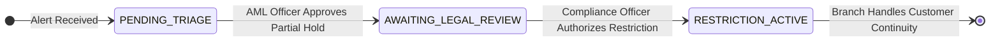
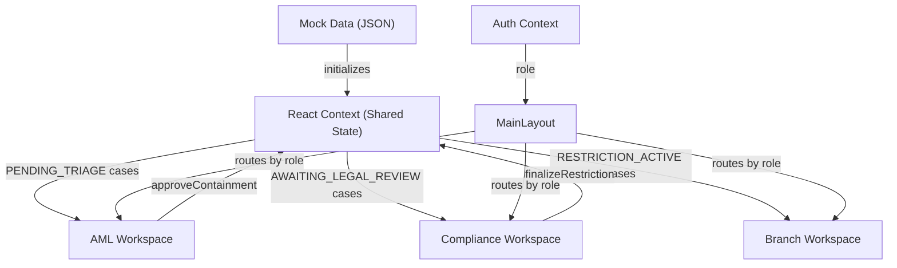

<div align="center">

# Muskets
### Post-Detection Containment and Operational Response Platform

> **Preserve legitimate customer activity while securing traced funds.**

**IOB Cybernova 2026 — Problem Statement 2: Advanced Controls for Mule Account Detection and AML Compliance**

[](https://muskets-containment-radar.vercel.app/)
[](#)

[](https://react.dev/)
[](https://vitejs.dev/)
[](https://tailwindcss.com/)
[](LICENSE)

</div>

---

## The Operational Challenge

When a suspicious transaction alert fires, funds have typically already moved across multiple accounts within seconds. The operational response that follows determines whether recoverable funds are secured, whether legitimate customers retain access to unaffected balances, and whether the resulting documentation meets regulatory and evidentiary standards.

Three operational gaps shape this challenge:

| Challenge | Operational Impact |
|:---|:---|
| Funds move across 3–5 accounts in under 90 seconds | Investigators require immediate visual clarity of where money went |
| Innocent account holders may receive stolen funds unknowingly | Restricting an entire account creates a second victim from a legitimate merchant |
| Investigation, legal review, and customer handling are separate workflows | Without shared case state, each role works from incomplete information |
| Manual evidence assembly across multiple screens | Investigators spend 3–4 hours per case preparing documentation that could be pre-assembled |

Muskets is designed to address the response layer — the operational workflow that activates after a detection system generates an alert.

---

## What Muskets Does

Muskets is a **post-detection operational response platform**. It does not perform fraud detection. It activates after an alert is generated and streamlines the containment, authorization, and customer handling workflow across three connected roles.

1. **Pre-assembled evidence** — When an investigator opens a case, the fund lineage graph and AI-prepared summary are already loaded. The investigator reviews and decides — never starting from an empty screen.

2. **Proportional restriction** — Instead of freezing an entire account, Muskets supports restricting only the traced amount. A merchant with ₹30L in their account who unknowingly received ₹50K in suspicious funds retains access to ₹29.5L.

3. **Shared case lifecycle** — A single case flows from AML investigation through legal authorization to branch-level customer handling. All three roles operate on the same data in real time.

4. **Operational documentation** — SAR reports and interbank coordination packets are generated directly from the case data, with audit-ready timelines and integrity hashes.

5. **Human-in-the-loop containment** — No restriction is applied without explicit human approval. The system prepares, recommends, and documents. The investigator decides.

---

## Core Innovation

### Workflow Continuity Engine

Muskets introduces a shared case state model where a single containment case progresses through three operational stages. Each role sees only the cases relevant to their function, but all actions are reflected immediately across the platform.

When an AML Officer approves a partial hold, the case appears instantly in the Compliance Officer's pending review queue. When the Compliance Officer authorizes the restriction, the Branch Manager sees the customer and their restriction details in their assigned cases list. No handoffs are lost. No data is re-entered.

### Proportional Restriction Model

Muskets introduces **proportional lien** — restricting only the exact traced amount rather than the full account balance.

```
LIEN = MIN(account_balance, traced_amount)
```

**Example:**
- Merchant account balance: **₹30,00,000**
- Traced suspicious funds: **₹50,000**
- Muskets restriction: ₹50,000 only → **₹29,50,000 remains accessible**
- Business continues at **98.3% capacity** — no disruption to legitimate operations

This formula is simple, auditable, and verifiable by any reviewing authority without requiring specialized technical knowledge.

### Human-in-the-Loop Containment

Every containment action in Muskets requires explicit human confirmation. The platform can prepare evidence, recommend actions, and pre-compute restriction amounts — but it cannot act. This design constraint ensures that human accountability is preserved at every stage, and that incorrect recommendations can be rejected before any operational impact occurs.

---

## The 3-Step Workflow



| Step | Role | Action | Outcome |
|:---:|:---|:---|:---|
| 1 | **AML Officer** | Reviews flagged case, views fund graph, approves partial hold | Case moves to legal review |
| 2 | **Compliance Officer** | Validates audit trail, generates SAR, authorizes restriction | Restriction becomes active |
| 3 | **Branch Manager** | Explains restriction to customer, collects clarification docs | Customer continuity maintained |

---

## Workspace Architecture

### AML Officer Workspace

The primary operational workspace where most product value is concentrated.

**What the officer sees:**
- **Priority Queue** — Cases ranked P1 (Critical), P2 (High), P3 (Medium) with live elapsed-time counters. The highest-risk cases surface first.
- **Fund Lineage Graph** — A force-directed network visualization showing the path of traced funds: Victim → Mule accounts → Merchant exits. Nodes are color-coded (blue for victims, red for mules, green for merchants).
- **AI Summary** — A pre-assembled one-line description of the incident pattern, including amounts, account counts, and timing.
- **Impact Comparison** — Side-by-side display of two containment options:
  - *Option A: Full Freeze* — Entire account balance blocked, business stops, lawsuit risk
  - *Option B: Partial Lien (Recommended)* — Only traced amount restricted, business continues

**Key action:** The officer clicks **Approve Partial Hold**. The case transitions to `AWAITING_LEGAL_REVIEW` and appears instantly in the Compliance workspace.

**Why it matters:** The investigator never manually traces accounts, never assembles evidence from scratch, and never starts from an empty screen. Time per case is reduced from hours to minutes.

---

### Compliance Officer Workspace

A governance and authorization workspace. The investigation is already complete — this workspace exists for structured legal review and documentation.

**What the officer sees:**
- **Pending Reviews Table** — Clean enterprise data table showing all cases awaiting legal sign-off, including case ID, customer name, traced amount, approving analyst, and timestamp.
- **Audit Timeline** — Vertical stepper showing the chronological history: Alert Received → Trace Completed → Analyst Approved → Awaiting Authorization.
- **Case Governance Panel** — Summary of the analyst's reasoning, financial breakdown, and recommended action.

**Key actions:**
- **Generate SAR PDF** — Suspicious Activity Report with full audit trail, transaction details, and integrity hash
- **Export DPIP Interbank Packet** — Standardized operational packet for interbank coordination workflows
- **Authorize & Finalize Restriction** — Transitions the case to `RESTRICTION_ACTIVE`

**Why it matters:** Compliance teams receive pre-structured documentation with complete audit trails. No manual report assembly is required. Export formats support regulatory reporting workflows.

---

### Branch Manager Workspace

A customer-facing operational continuity workspace. Branch staff handle the human side of containment — communicating with affected customers and collecting clarification documents.

**What the manager sees:**
- **Assigned Customer Cases** — List of customers with active restrictions who may visit the branch. Each card shows the customer name, restricted amount, available balance, and a visual impact bar.
- **Restriction Explanation** — Pre-written communication template: *"A proportional restriction has been placed on this account as part of an ongoing investigation. Essential banking services remain fully active."*
- **Impact Visibility** — Visual breakdown showing restricted funds vs. available balance, so branch staff can clearly communicate what remains accessible.

**Key actions:**
- **Upload Clarification Documents** — Drag-and-drop zone for KYC documents, invoices, or GST proofs provided by the customer
- **Escalate for Central Review** — Send the case back to the central AML team with notes if the customer disputes the restriction

**Operational constraint:** Branch staff **cannot** modify or release restrictions. All restriction decisions are managed exclusively by AML and Compliance teams. This separation ensures that containment integrity is maintained at the branch level.

**Why it matters:** When a customer walks into a branch asking "Why is my account restricted?", the branch manager has immediate access to the explanation, the financial impact breakdown, and a clear escalation path — without needing to contact the central team first.

---

## Fund Lineage Visualization

Muskets provides an operational evidence visualization that displays the path of traced funds through the account network.

Each case is associated with a graph structure showing:
- **Victim nodes** (blue) — Source accounts from which funds were diverted
- **Mule nodes** (red) — Intermediate accounts used to relay funds
- **Merchant nodes** (green) — Downstream accounts that received funds, often belonging to legitimate businesses

The graph is rendered as an interactive force-directed network. Investigators can pan, zoom, and inspect individual nodes to understand the fund path before making a containment decision.

This visualization replaces the manual process of opening multiple banking tabs and tracing transactions sequentially. The complete fund path is assembled and displayed in one view.

---

## Proportional Restriction Logic

Muskets uses a single, transparent formula for all restriction calculations:

```
LIEN = MIN(account_balance, traced_amount)
```

| Variable | Meaning |
|:---|:---|
| `account_balance` | Current balance of the account being restricted |
| `traced_amount` | Total suspicious funds traced to this account |

**Plain English:** The restricted amount never exceeds either the traced suspicious funds or the actual account balance — whichever is smaller. This ensures that restrictions are mathematically proportional and that no account is over-restricted.

**Example:**

| Scenario | Account Balance | Traced Funds | Restriction | Available |
|:---|:---:|:---:|:---:|:---:|
| Merchant received partial stolen funds | ₹30,00,000 | ₹50,000 | ₹50,000 | ₹29,50,000 |
| Mule account nearly emptied | ₹8,200 | ₹60,000 | ₹8,200 | ₹0 |

This formula is auditable, verifiable without specialized knowledge, and requires human confirmation before application.

---

## SAR and DPIP Workflow

### Suspicious Activity Report (SAR)

The Compliance workspace generates SAR PDFs directly from case data. Each report includes:

- Case identification and priority classification
- AI-prepared incident summary
- Financial breakdown (risk amount, traced amount, containment action)
- Analyst who approved the containment and timestamp
- Audit timeline (alert → trace → approval → authorization)
- SHA-256 integrity hash for tamper detection

### DPIP Interbank Coordination Packet

For cases involving accounts across multiple banks, the Compliance workspace exports a standardized operational packet containing:

- Case reference and traced amount
- Affected account numbers and recommended hold types
- Incident summary for recipient bank coordination

Muskets generates these packets in a structured format designed for interbank operational sharing workflows. The prototype simulates packet generation; production deployment would integrate with DPIP API infrastructure.

---

## Compliance Alignment

| Regulation | Muskets Support |
|:---|:---|
| **BSA 2023, Section 63** | Exports primary evidence (timestamps, amounts, fund paths) before derived conclusions. Audit trail with SHA-256 hash supports electronic record admissibility. |
| **RBI Fraud Risk Management 2024** | SAR generation with audit timelines supports prescribed reporting workflows. |
| **PMLA Section 12AA** | Proportional lien secures recoverable funds without disproportionate impact on third parties. |
| **Human Accountability** | No automated restriction without explicit investigator confirmation. Every action logged with operator identity and timestamp. |

---

## Frontend Architecture

The prototype implements workflow continuity using React Context shared state. All three workspaces read from and write to the same cases array. When one role updates a case status, the change is immediately visible to the other roles.



**Key design decisions:**
- A single `cases` array is the source of truth for all workspaces
- Status transitions (`PENDING_TRIAGE` → `AWAITING_LEGAL_REVIEW` → `RESTRICTION_ACTIVE`) drive which workspace displays which cases
- No backend is required for the prototype — all state lives in the browser session
- Graph structures are loaded from static JSON keyed by case ID
- Role-based rendering is handled through a lightweight auth context

---

## Technical Stack

| Layer | Technology | Purpose |
|:---|:---|:---|
| **UI Framework** | React 19 + Vite 8 | Component architecture and state management |
| **Styling** | TailwindCSS 4 | Utility-first responsive design |
| **Graph Rendering** | react-force-graph-2d | Force-directed fund lineage visualization |
| **Animation** | Framer Motion | Smooth workspace transitions and case animations |
| **PDF Generation** | jsPDF + jsPDF-AutoTable | SAR and DPIP packet export |
| **State Management** | React Context API | Shared case lifecycle across all workspaces |
| **Icons** | Lucide React | Consistent operational iconography |
| **Deployment** | Vercel | Static single-page application hosting |

---

## What Is Built vs. What Is Planned

| Feature | Status | Notes |
|:---|:---|:---|
| 3-role operational workflow | **Built — prototype** | AML → Compliance → Branch with shared state |
| Priority-based investigation queue | **Built — prototype** | P1/P2/P3 ranking with live elapsed timers |
| Fund lineage graph visualization | **Built — prototype** | 5 graph topologies with color-coded nodes |
| Proportional lien comparison | **Built — prototype** | Full Freeze vs. Partial Lien side-by-side |
| SAR PDF generation | **Built — prototype** | Audit timeline + financial breakdown + SHA-256 hash |
| DPIP interbank packet export | **Built — prototype** | Structured PDF with account-level freeze instructions |
| Role-based workspace routing | **Built — prototype** | Mock auth with three roles |
| Branch customer handling | **Built — prototype** | Restriction explanation, doc upload, escalation |
| Real-time transaction ingestion | **Not built** | Prototype uses static mock data. Requires Kafka or equivalent. |
| Core banking API integration | **Not built** | Real lien/freeze enforcement requires Finacle or core banking API. |
| Graph database persistence | **Not built** | Prototype uses in-memory JSON. Production requires Neo4j or equivalent. |
| Cross-bank tracing | **Not built** | Inter-bank fund tracing requires DPIP API access. |
| Production authentication | **Not built** | Real deployment requires SSO/LDAP integration. |

---

## Demo Walkthrough

### Quick Start

```bash
git clone https://github.com/bhargava562/muskets-containment-radar.git
cd muskets-containment-radar/frontend
npm install
npm run dev
```

Open `http://localhost:5173`

### Walkthrough

**Step 1 — AML Officer**

Login with any Employee ID, any password, role: **AML Compliance Officer**

- See 3 cases in the priority queue (2× P1 Critical, 1× P2 High)
- Click a P1 case → fund lineage graph loads in the center panel
- Review the AI summary and impact comparison in the right panel
- Click **Approve Partial Hold** → case disappears from queue with animation

**Step 2 — Compliance Officer**

Logout → Login with role: **Legal & Principal Officer**

- See the newly approved case in the Pending Reviews table
- Click the case row to view the audit timeline and governance details
- Click **Generate SAR PDF** → PDF downloads with full evidence bundle
- Click **Authorize & Finalize Restriction** → case moves to active

**Step 3 — Branch Manager**

Logout → Login with role: **Branch Manager**

- See the restricted customer in the Assigned Cases list
- Click the customer → see restriction explanation and impact visualization
- View the animated bar showing restricted funds (amber) vs. available balance (green)
- Upload clarification documents or escalate for central review
- Note: no option to release or modify the restriction exists

---

## Future Roadmap

| Phase | Description | Duration |
|:---|:---|:---:|
| **Phase 1 — Shadow Mode** | Deploy alongside existing AML workflow. No enforcement. Measure operational alignment with real investigator outcomes. | 60 days |
| **Phase 2 — Integration** | Connect to core banking API for real transaction events. Integrate Neo4j for graph persistence. Enable human-approved lien enforcement. | 45 days |
| **Phase 3 — Calibration** | Investigator feedback loop. SAR export validation with compliance and legal teams. Threshold tuning against historical case data. | 60 days |
| **Phase 4 — Scale** | Multi-bank DPIP integration. Kubernetes deployment for institutional-scale operations. | 90 days |

---

## Known Limitations

1. All case and transaction data is simulated from a static JSON file. No real banking data feed is connected.

2. The SHA-256 hash in exported PDFs is generated client-side. In production, this would be a cryptographic hash of actual containment decision data stored in a write-once audit database.

3. Cross-bank fund tracing is not implemented. The graph shows only accounts within the simulated network. Real inter-bank tracing requires DPIP API access.

4. The proportional lien is displayed and recommended but not enforced against a real core banking system. Production deployment requires Finacle or equivalent API integration.

---

<div align="center">

**Built for IOB Cybernova Hackathon 2026**
Problem Statement 2: Advanced Controls for Mule Account Detection and AML Compliance

*Muskets is designed to ensure investigators never begin from an empty operational screen.*

</div>
