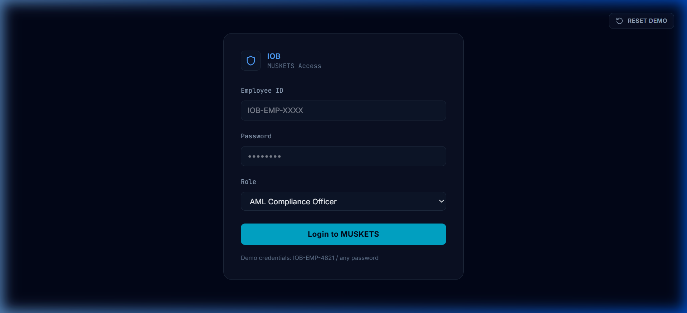
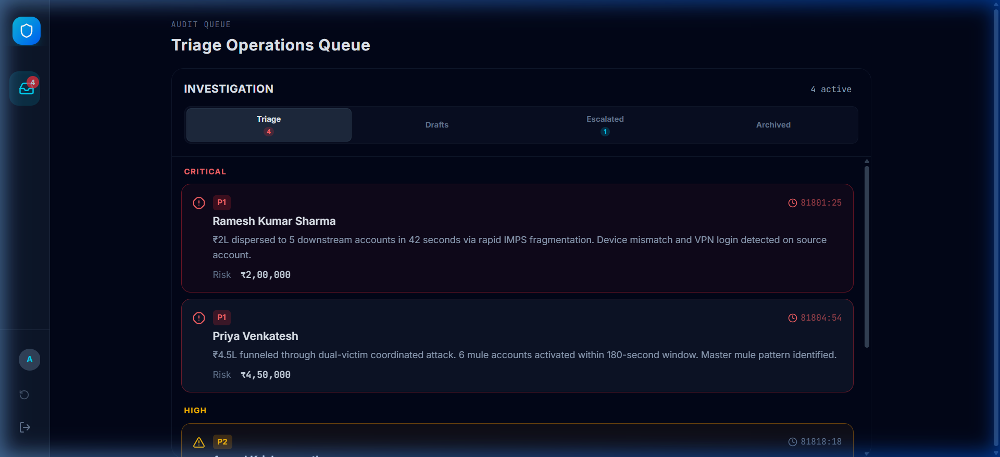
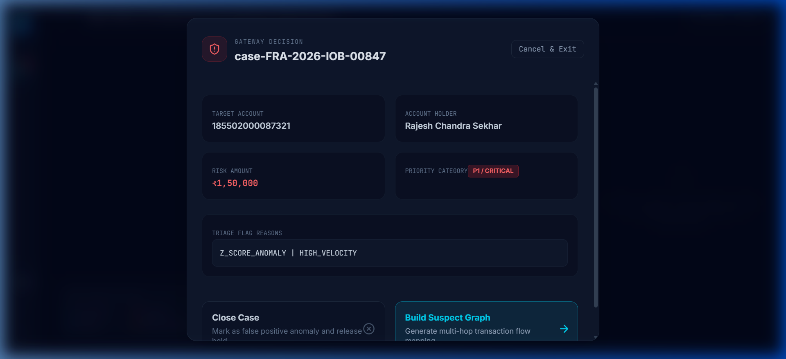
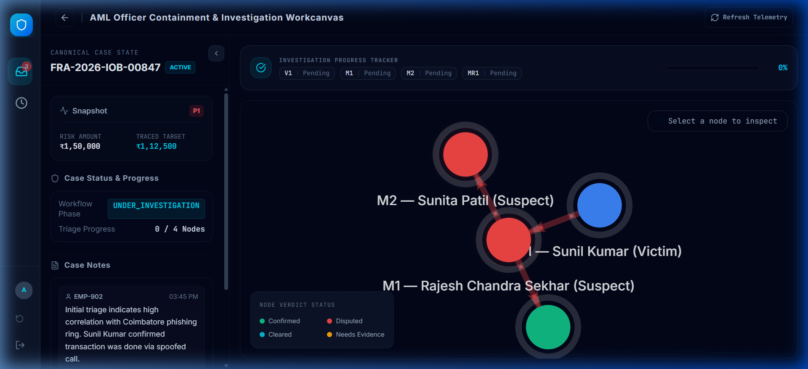
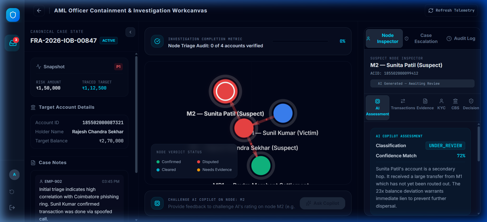
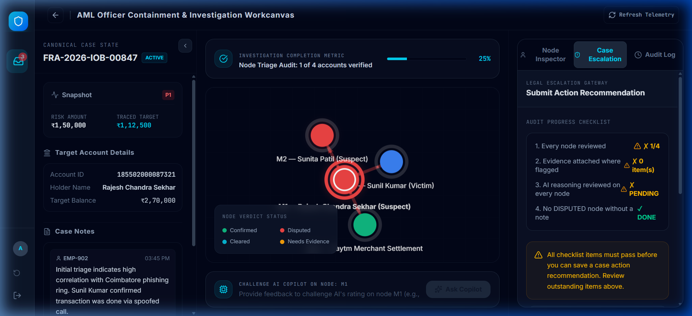
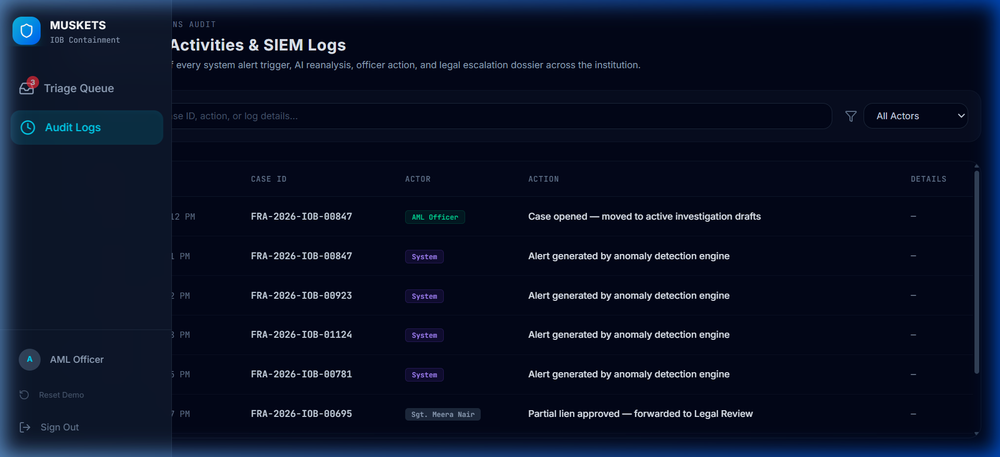
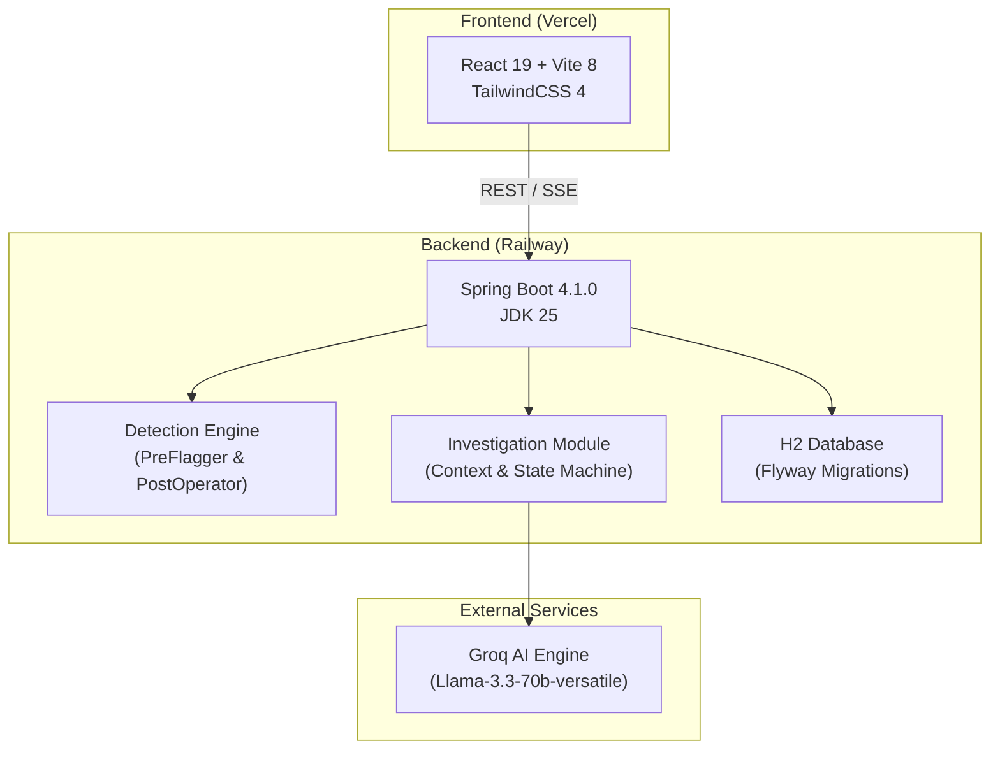
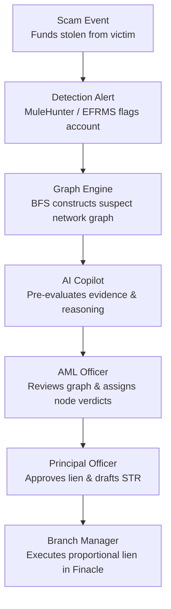
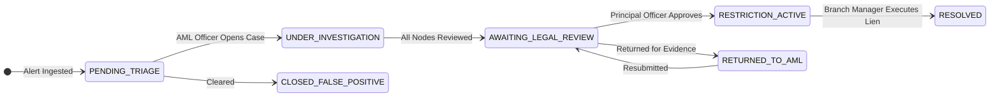

<div align="center">

# 🔫 MUSKETS
### AI-Assisted Post-Detection Investigation & Proportional Containment Workspace for Mule Account Operations

> **Preserve legitimate customer activity while securing traced fraudulent funds.**

**IOB Cybernova 2026 — Problem Statement 2: Advanced Controls for Mule Account Detection and AML Compliance**

[](https://muskets-containment-radar.vercel.app/)
[](https://muskets-mock.up.railway.app)
[](https://github.com/bhargava562/muskets-containment-radar/actions/workflows/ci.yml)
[](#)

[](https://spring.io/projects/spring-boot)
[](https://openjdk.org/)
[](https://react.dev/)
[](https://vitejs.dev/)
[](https://tailwindcss.com/)

</div>

---

## ⚡ Executive Summary

**MUSKETS** is an investigation intelligence and containment workspace designed specifically for bank AML compliance teams, fraud analysts, and branch managers. 

It bridges the **fatal operational gap** between fraud detection (RBI's MuleHunter.AI / EFRMS) and core banking containment (Finacle / BaNCS). Instead of defaulting to illegal 100% account freezes or requiring analysts to manually navigate 6+ disconnected banking portals, MUSKETS pre-assembles a relational transaction graph, AI-driven evidence reasoning, and precise **Proportional Lien Containment** in minutes.

---

## 📷 Interface Screenshots

### 1. Role-Based Access Control & Login


### 2. Triage Operations Queue — Priority Alert Management


### 3. Gateway Decision — Case Intake Modal


### 4. AML Officer Investigation Workcanvas — Force-Directed Suspect Graph


### 5. AI Copilot Assessment & Explainable Reasoning Panel


### 6. Case Escalation — Progress-Gated Validation Checklist


### 7. Audit Logs — SIEM Activity Feed & System Trace


---

## 🎯 The Operational Gap & IOB Context

### The Problem: Detection is Solved. Containment is Broken.

- **MuleHunter.AI** (developed by RBIH) is deployed across 26+ banks with 85%+ accuracy. **Detection is solved.**
- **The Gap**: After an alert fires, investigators spend hours logging into Finacle CBS, C-KYC, transaction ledgers, and 1930 NCRP complaint portals. By the time evidence is gathered, fraudulent money has been exfiltrated through layering networks.
- **The Crisis**: In 2024, out of ₹22,845.73 crore in reported cyber-fraud, only **2.18% (₹167 crore)** was successfully restored to victims due to containment delays.

### IOB Legal Precedent
> **M/S S.A. Enterprises v. Reserve Bank of India & Indian Overseas Bank** *(Allahabad High Court, 2026 LiveLaw (AB) 282)*  
> **Indian Overseas Bank (IOB)** was fined ₹50,000 for placing a 100% debit freeze on a fisheries machinery firm's account over a single ₹23 lakh RTGS credit.  
> Court Ruling: ***"The Bank cannot metamorphose itself into an investigating agency or freeze 100% of an operational business account over a single disputed credit."***

---

## 🏗️ System Architecture & Workflow

### High-Level Architecture


```mermaid
graph TD
    subgraph Client["Frontend (Vercel)"]
        UI["React 19 + Vite 8\nTailwindCSS 4"]
    end

    subgraph Server["Backend (Railway)"]
        API["Spring Boot 4.1.0\nJDK 25"]
        DET["Detection Engine\n(PreFlagger & PostOperator)"]
        INV["Investigation Module\n(Context & State Machine)"]
        DB["H2 Database\n(Flyway Migrations)"]
    end

    subgraph External["External Services"]
        AI["Groq AI Engine\n(Llama-3.3-70b-versatile)"]
    end

    UI -->|"REST / SSE"| API
    API --> DET
    API --> INV
    INV --> AI
    API --> DB
```

### End-to-End Core Operational Pipeline


```mermaid
flowchart TD
    A["Scam Event\nFunds stolen from victim"] --> B["Detection Alert\nMuleHunter / EFRMS flags account"]
    B --> C["Graph Engine\nBFS constructs suspect network graph"]
    C --> D["AI Copilot\nPre-evaluates evidence & reasoning"]
    D --> E["AML Officer\nReviews graph & assigns node verdicts"]
    E --> F["Principal Officer\nApproves lien & drafts STR"]
    F --> G["Branch Manager\nExecutes proportional lien in Finacle"]
```

### Role-Based State Machine


```mermaid
stateDiagram-v2
    direction LR
    [*] --> PENDING_TRIAGE : Alert Ingested
    PENDING_TRIAGE --> UNDER_INVESTIGATION : AML Officer Opens Case
    UNDER_INVESTIGATION --> AWAITING_LEGAL_REVIEW : All Nodes Reviewed
    AWAITING_LEGAL_REVIEW --> RESTRICTION_ACTIVE : Principal Officer Approves
    AWAITING_LEGAL_REVIEW --> RETURNED_TO_AML : Returned for Evidence
    RETURNED_TO_AML --> AWAITING_LEGAL_REVIEW : Resubmitted
    RESTRICTION_ACTIVE --> RESOLVED : Branch Manager Executes Lien
    PENDING_TRIAGE --> CLOSED_FALSE_POSITIVE : Cleared
```

---

## 👥 The 3-Step Operational Roles

1. **AML Investigation Officer**:
   - Reviews triage alerts, navigates the interactive suspect graph canvas, inspects node profiles across 6 dedicated tabs (AI Assessment $\to$ Txns $\to$ Evidence $\to$ KYC $\to$ CBS $\to$ Decision).
   - Promotes unlisted counterparty nodes via AI Copilot dynamic network expansion.
   - Enforces progress-gated checklist validation before escalating to legal.

2. **Principal Officer (Compliance)**:
   - Reviews escalated case dossiers, validates evidence packages, and pre-fills FIU-IND Suspicious Transaction Reports (STR) using PMLA 12AA compliance narratives.
   - Authorizes proportional liens and generates signed Case Evidence Packages with SHA-256 integrity digests.

3. **Branch Manager**:
   - Operates a non-technical operational execution panel showing clear separation between **Locked Funds (Lien)** and **Free Working Capital**.
   - Applies the Finacle CBS lien mark to resolve cases while protecting legitimate customer funds.

---

## 📚 Technical Documentation Index

For in-depth mathematical formulas, detection algorithms, data schemas, API contracts, and case execution traces, explore the comprehensive documentation suite in [`/docs`](docs/):

| Document | Detailed Contents |
|:---|:---|
| 📑 [`01-PROBLEM-STATEMENT.md`](docs/01-PROBLEM-STATEMENT.md) | Operational containment gap, IOB legal precedents, 5-step failure chain, recovery statistics. |
| 🏗️ [`02-SOLUTION.md`](docs/02-SOLUTION.md) | Complete solution architecture, Proportional Lien math, Case `FRA-2026-IOB-00847` trace matrix. |
| 📜 [`03-RESEARCH-EVIDENCE.md`](docs/03-RESEARCH-EVIDENCE.md) | Source-tiered evidence base (🟢 Verified / 🟡 Sourced / 🔴 Excluded), High Court case law analysis. |
| 🧮 [`04-DETECTION-MODULE-IMPLEMENTATION.md`](docs/04-DETECTION-MODULE-IMPLEMENTATION.md) | **Mathematical Specifications**: Welford's Z-Score algorithm, Fragmentation Ratio ($FR$), Propagation Velocity ($V$), Dwell Time, Composite Risk formula, Bounded BFS algorithm. |
| 🔍 [`05-AML-OFFICER-INVESTIGATION-WORKBENCH.md`](docs/05-AML-OFFICER-INVESTIGATION-WORKBENCH.md) | AML Officer workbench specs, Node Inspector tabs, AI Copilot schema contracts, dynamic node promotion. |
| ⚖️ [`06-PRINCIPAL-OFFICER-AND-BRANCH-MANAGER.md`](docs/06-PRINCIPAL-OFFICER-AND-BRANCH-MANAGER.md) | Principal Officer STR Studio (FIU-IND/PMLA), Case Evidence Package generator, Branch Manager lien execution. |
| ⚙️ [`07-CODE-REVIEW-FIXES-AND-VERIFICATION.md`](docs/07-CODE-REVIEW-FIXES-AND-VERIFICATION.md) | Static code review findings, compiler warning fixes, ArchUnit module boundary verification. |
| 🔒 [`08-SECURITY-AND-CREDENTIALS-SAFETY.md`](docs/08-SECURITY-AND-CREDENTIALS-SAFETY.md) | PII protection, environment variable resolution, Groq API key safety, gitignore rules. |

---

## 🛠️ Quick Start & Development

### Prerequisites
- **JDK 25** (Eclipse Temurin)
- **Node.js 24+** & **npm 10+**

### Backend Execution (Spring Boot)
```bash
cd backend
./mvnw clean package -DskipTests
java -jar target/*.jar
```
*Backend runs on `http://localhost:8080`*.

### Frontend Execution (React + Vite)
```bash
cd frontend
npm install
npm run dev
```
*Frontend runs on `http://localhost:5173`*.

### Reset Demo Environment API
To reset the demonstration state back to pristine baseline at any time:
```bash
curl -X POST http://localhost:8080/reset
```

---

<div align="center">

**Built for Indian Overseas Bank (IOB) Cybernova 2026**

*Precision Post-Detection Containment & Operational Response Platform*

</div>
