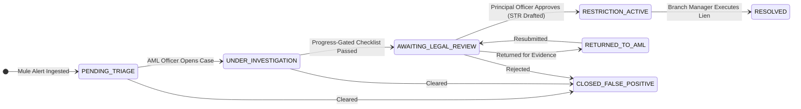

<div align="center">

# 🔫 MUSKETS
### AI-Assisted Post-Detection Investigation & Proportional Containment Workspace for Mule Account Operations

> **Preserve legitimate customer activity while securing traced funds.**

**IOB Cybernova 2026 — Problem Statement 2: Advanced Controls for Mule Account Detection and AML Compliance**

[](https://muskets-containment-radar.vercel.app/)
[](https://muskets-mock.up.railway.app)
[](https://github.com/bhargava562/muskets-containment-radar/actions/workflows/ci.yml)
[](#)

[](https://spring.io/projects/spring-boot)
[](https://openjdk.org/)
[](https://react.dev/)
[](https://vitejs.dev/)
[](https://tailwindcss.com/)

</div>

---

## Technical Master Architecture & Solution Document

This document serves as the authoritative technical specification of **MUSKETS** for bank officials, AML compliance directors, judicial auditors, and IOB Cybernova 2026 evaluators.

---

## Table of Contents

1. [Operational Problem & Industry Context](#1-operational-problem--industry-context)
2. [Existing System Limitations vs. MUSKETS Architecture](#2-existing-system-limitations-vs-muskets-architecture)
3. [System Architecture & Core Pipeline](#3-system-architecture--core-pipeline)
4. [Input Data Schemas & Signal Ingestion](#4-input-data-schemas--signal-ingestion)
5. [Detection & Graph Mathematics (Algorithms & Formulas)](#5-detection--graph-mathematics-algorithms--formulas)
6. [AI Investigation Orchestration & Guardrails](#6-ai-investigation-orchestration--guardrails)
7. [Role-Based Workflows & State Machine](#7-role-based-workflows--state-machine)
8. [Real-World Case Execution Proof (Case FRA-2026-IOB-00847)](#8-real-world-case-execution-proof-case-fra-2026-iob-00847)
9. [Regulatory & Evidentiary Compliance](#9-regulatory--evidentiary-compliance)
10. [Setup, Build & Deployment Guide](#10-setup-build--deployment-guide)

---

## 1. Operational Problem & Industry Context

### 1.1 The Real-World Problem: Detection vs. Containment

Modern mule account fraud is **not a detection problem**. 

Indian banks already operate sophisticated detection mechanisms:
- **MuleHunter.AI**: Developed by the Reserve Bank Innovation Hub (RBIH), live across 26+ scheduled commercial banks with 85%+ accuracy.
- **Transaction Monitoring Systems (TMS)**: Real-time rules engines scanning UPI, IMPS, and NEFT flows.
- **CFCFRMS (I4C Portal)**: Citizen Financial Cyber Fraud Reporting and Management System receiving live victim complaints via 1930.

However, after detection alerts fire, a **fatal operational gap** occurs:

```
[ Fraud Event ] ──► [ Detection Alert (MuleHunter / TMS) ] ──► ❌ [ Operational Delay (Manual Isolation) ] ──► [ Funds Exfiltrated ]
                                                                       │
                                                                       ▼
                                                           [ Binary Blanket Freeze ]
                                                                       │
                                                                       ▼
                                                           [ High Judicial Penalty ]
```

1. **Manual Data Assembly**: Investigators must open 6+ disconnected banking portals (CBS, KYC, Transaction Ledger, Device Intelligence, Cyber Complaints, STR filing software).
2. **Transaction Table Limitations**: Flat tabular lists fail to reveal multi-hop layering, hub-and-spoke networks, or cashout points.
3. **Binary CBS Freeze Default**: Because banks lack precise, granular containment tools, core banking operators default to **100% Debit Freezes**, locking legitimate customer funds (salary, business working capital) alongside fraudulent credits.
4. **Recovery Rate Collapse**: Out of ₹22,845.73 crore in cyber-fraud losses reported in 2024, only **2.18% (₹167 crore)** was successfully restored to victims due to investigation delays.

### 1.2 Institutional Precedent: IOB Penalization

> **M/S S.A. Enterprises v. Reserve Bank of India & Indian Overseas Bank**  
> *(Allahabad High Court, 2026 LiveLaw (AB) 282)*  
>
> **Indian Overseas Bank (IOB)** was fined ₹50,000 for arbitrarily placing a 100% debit freeze on a fisheries machinery firm's account after a legitimate ₹23 lakh RTGS credit, without a formal police complaint or statutory order.  
> Court Ruling: ***"The Bank cannot metamorphose itself into an investigating agency or freeze 100% of an operational business account over a single disputed credit."***

MUSKETS directly solves this precise liability for IOB by introducing **Proportional Lien Containment** backed by an auditable, graph-native investigation workspace.

---

## 2. Existing System Limitations vs. MUSKETS Architecture

### 2.1 Multi-System Data Fragmentation Matrix

| Data Dimension | Legacy Bank Flow | MUSKETS Unified Intelligence Layer |
|:---|:---|:---|
| **Core Banking System (CBS)** | Manual lookup in Finacle / BaNCS | Pre-indexed account state, Lien status, unencumbered balance |
| **KYC Repository** | Manual document fetch from C-KYC | Instant verification of identity, mobile, occupation, customer age |
| **Transaction Stream** | Flat SQL table queries | Dynamic Force-Directed Transaction Graph ($N$-hop tracing) |
| **Cyber Complaint Ledger** | Email / PDF manual cross-check | Live 1930 NCRP complaint linkage directly on victim/mule nodes |
| **Device Intelligence** | Separate security portal logs | Integrated SIM swap, Geo-velocity, and failed login telemetry |
| **Containment Action** | Manual 100% CBS Debit Freeze | Automated Proportional Lien Calculation ($L = \min(\text{Bal}, \text{Traced})$) |

### 2.2 Relational Graph vs. Flat Tabular View

Traditional tabular view:
```
Txn ID     | From Account | To Account   | Amount   | Timestamp
TXN87321001| 185501000012 | 185502000087 | ₹1,50,000| 10:14:02
TXN87321003| 185502000087 | 185502000099 | ₹1,05,000| 10:18:45
TXN87321009| 185502000099 | 185502000011 | ₹90,000  | 10:22:11
```
*Inference Difficulty*: Cannot determine central collection hubs, fan-out points, or circular money loops.

**MUSKETS Graph Reasoning Engine**:
```
[ Victim (V1) ] ──(₹1.5L UPI)──► [ Mule 1 (M1) ] ──(₹1.05L IMPS)──► [ Mule 2 (M2) ]
                                      │                                 │
                               (₹40k Paytm Escrow)            (₹90k Unlisted Hop)
                                      │                                 │
                                      ▼                                 ▼
                              [ Merchant (MR1) ]                [ Mule 3 (M3) ] ──► [ Escrow (MR2) ]
```

---

## 3. System Architecture & Core Pipeline

```mermaid
graph TB
    subgraph "Client Layer — React 19 + Vite 8"
        UI["AML Workspace UI"]
        GRAPH["react-force-graph-2d Canvas"]
        DRAWER["Node Inspector & AI Panel"]
    end

    subgraph "Backend Engine — Spring Boot 4.1.0 (JDK 25)"
        CTRL["REST API Controllers"]
        INGEST["Transaction Ingestion & Event Publisher"]
        
        subgraph "Detection Module"
            PRE["PreFlaggerEngine (O(1) Streaming Math)"]
            POST["PostOperatorEngine (Bounded BFS Graph Builder)"]
        end
        
        subgraph "Investigation Module"
            STORE["InvestigationContextStore (In-Memory H2)"]
            STATE["InvestigationStatusMachine"]
            AI_ORCH["AiOrchestrationService"]
        end
    end

    subgraph "AI Provider Layer"
        GROQ["Groq API (Llama-3.3-70b-versatile)"]
        MOCK["MockAiEvaluator (Offline Fallback)"]
    end

    UI <──►|"REST / SSE (/events, /api/investigation/**)"| CTRL
    CTRL ──► INGEST
    INGEST ──► PRE
    PRE ──► POST
    POST ──► STORE
    STORE ──► AI_ORCH
    AI_ORCH ──► GROQ
    AI_ORCH ──► MOCK
```

---

## 4. Input Data Schemas & Signal Ingestion

### 4.1 Account Attributes Schema
```json
{
  "accountId": "185502000087321",
  "customerType": "INDIVIDUAL",
  "accountAgeDays": 14,
  "kycStatus": "VERIFIED_C_KYC",
  "branchLocation": "Chennai Main Branch (00412)",
  "accountOpeningDate": "2026-07-01T00:00:00Z",
  "totalBalance": 162500.00,
  "lienAmount": 0.00
}
```

### 4.2 Transaction Attributes Schema
```json
{
  "txnId": "TXN87321009",
  "fromAccount": "185502000099412",
  "toAccount": "185502000011234",
  "amount": 90000.00,
  "timestamp": "2026-07-26T10:22:11Z",
  "channel": "UPI",
  "narration": "UPI/ToDeshmukh/MedicalEmergency",
  "velocityTxPerMin": 14.2
}
```

### 4.3 Telemetry & Network Attributes Schema
```json
{
  "deviceHash": "DEV-88492019482",
  "simChangedIn72h": true,
  "failedLoginAttempts": 4,
  "geoVelocityFlag": true,
  "linkedComplaintId": "NCRP-2026-994821"
}
```

---

## 5. Detection & Graph Mathematics (Algorithms & Formulas)

Muskets deploys a **Two-Speed Engine Design**:
1. **`PreFlaggerEngine`**: $O(1)$ streaming calculation running on every inbound transaction.
2. **`PostOperatorEngine`**: Bounded Breadth-First Search (BFS) graph generator executed when an investigation is opened.

```
       ┌─────────────────────────────────────────────────────────┐
       │                   Incoming Transaction                  │
       └────────────────────────────┬────────────────────────────┘
                                    │
                                    ▼
       ┌─────────────────────────────────────────────────────────┐
       │     PreFlaggerEngine (O(1) Memory State Update)         │
       │  - Welford's Z-Score (|Z| > 3.0)                        │
       │  - Fragmentation Ratio (FR > 3.0)                       │
       │  - Velocity Index (> 10 tx/min)                         │
       │  - Dwell Time (< 5 min)                                 │
       └────────────────────────────┬────────────────────────────┘
                                    │
                         Is Risk Score Threshold Met?
                                   / \
                                  /   \
                             Yes /     \ No
                                /       \
                               ▼         ▼
             ┌───────────────────┐     ┌───────────────────┐
             │ Publish Alert     │     │ Pass Silently     │
             └─────────┬─────────┘     └───────────────────┘
                       │
                       ▼
             ┌───────────────────────────────────────────────────┐
             │ PostOperatorEngine (Bounded BFS Graph Builder)     │
             │ Max Hops = 4, Time Window = 48 Hours               │
             └───────────────────────────────────────────────────┘
```

---

### 5.1 Signal 1: Z-Score Anomaly (Welford's Algorithm)

To maintain $O(1)$ computation without storing historical transaction lists in memory, Muskets uses **Welford's Algorithm** for online mean and variance:

$$M_1 = x_1, \quad M_k = M_{k-1} + \frac{x_k - M_{k-1}}{k}$$

$$S_1 = 0, \quad S_k = S_{k-1} + (x_k - M_{k-1})(x_k - M_k)$$

$$\sigma_k = \sqrt{\frac{S_k}{k-1}}$$

Self-Calibrated Z-Score:
$$Z_k = \frac{x_k - M_k}{\sigma_k}$$

**Trigger Condition**: $|Z_k| > 3.0$ (3-sigma statistical anomaly).

---

### 5.2 Signal 2: Fragmentation Ratio ($FR$) — Layering Intensity

Measures structured fan-out (smurfing) by comparing rapid outbound splits to historical daily baseline:

$$FR = \frac{\text{Outbound Splits in } 10 \text{ minutes}}{\text{Historical Daily Average Outbound Splits}}$$

**Trigger Condition**: $FR > 3.0$ (Indicates active structuring/layering node).

---

### 5.3 Signal 3: Propagation Velocity Index ($V$)

$$V = \frac{\text{Outbound Transaction Count}}{\Delta t \text{ (minutes)}}$$

**Trigger Condition**: $V > 10.0 \text{ tx/min}$ (Indicates script/bot-automated mule distribution).

---

### 5.4 Signal 4: Fund Retention Duration ($T_{\text{dwell}}$)

$$T_{\text{dwell}} = t_{\text{first\_outbound}} - t_{\text{inbound\_credit}}$$

**Trigger Condition**: $T_{\text{dwell}} < 5 \text{ minutes}$ (Critical mule relay indicator).

---

### 5.5 Composite Risk Scoring Formula

$$R_{\text{composite}} = \min\left(100, \, w_{\text{txn}} \cdot R_{\text{txn}} + w_{\text{net}} \cdot R_{\text{net}} + w_{\text{beh}} \cdot R_{\text{beh}} + w_{\text{ev}} \cdot R_{\text{ev}}\right)$$

Where:
- $R_{\text{txn}} = \min(100, \, 30 \cdot |Z| + 20 \cdot FR)$
- $R_{\text{net}} = (\text{In-Degree} \times 15) + (\text{Out-Degree} \times 25) + (\text{Flow Volume Weight})$
- $R_{\text{beh}} = 25 \cdot \mathbb{I}(\text{AccountAge} < 30\text{d}) + 25 \cdot \text{NegativeBalanceStreak}$
- $R_{\text{ev}} = 30 \cdot \mathbb{I}(\text{Linked NCRP Complaint}) + 20 \cdot \mathbb{I}(\text{SIM Swap } 72\text{h})$

---

### 5.6 Proportional Lien Mathematics vs. Blanket Freeze

Instead of freezing 100% of an account:

$$\text{Lien Amount } (L) = \min\left(\text{Available Balance}, \, \text{Traced Fraudulent Inflow}\right)$$

$$\text{Free Working Capital } (F) = \max\left(0, \, \text{Available Balance} - L\right)$$

*Example*: A business account with ₹30,00,000 balance receives a ₹1,05,000 mule transfer.
- **Legacy CBS**: $L = ₹30,00,000, \, F = ₹0$ (**Illegal under High Court Rulings**).
- **MUSKETS**: $L = ₹1,05,00, \, F = ₹28,95,000$ (**Compliant & Risk-Free**).

---

## 6. AI Investigation Orchestration & Guardrails

### 6.1 Explainable AI Architecture (Groq / Llama-3.3-70b)

```
[ Raw Node & Txn Payload ] ──► [ Masked JSON Context ] ──► [ Groq AI Engine (OpenAI API Compatible) ]
                                                                      │
                                                                      ▼
[ UI Render & Telemetry ] ◄── [ Structural Validation ] ◄── [ JSON Schema Response ]
```

### 6.2 Strict Response Schema Contract (`AiSchemaContract`)
```json
{
  "nodeId": "M2",
  "aiClassification": "SUSPECTED_MULE",
  "confidence": 0.94,
  "evidence": [
    {
      "evidenceId": "EV-M2-01",
      "source": "TRANSACTION_PATTERN",
      "derivedFrom": "Layered transfer of ₹90,000 to unlisted counterparty 185502000011234 within 3.5 minutes of receiving funds",
      "weight": 0.95,
      "linkedRecordId": "TXN87321009"
    }
  ],
  "recommendedAction": "PROPORTIONAL_LIEN"
}
```

### 6.3 Dynamic Network Expansion Algorithm
When an investigator or AI identifies an unlisted transaction (e.g. `TXN87321009` to account `185502000011234` / Sanjay Deshmukh):

```java
// InvestigationContext.java transitive preview promotion logic
Set<String> nodesToPromote = new HashSet<>();
nodesToPromote.add("M3");

boolean expanded = true;
while (expanded) {
    expanded = false;
    for (GraphEdge pEdge : this.expandPreview.edges()) {
        if (nodesToPromote.contains(pEdge.fromNodeId()) || nodesToPromote.contains(pEdge.toNodeId())) {
            if (nodesToPromote.add(pEdge.fromNodeId())) expanded = true;
            if (nodesToPromote.add(pEdge.toNodeId())) expanded = true;
        }
    }
}
```
*Result*: Promotes `M3` and connected preview node `MR2` into active graph context seamlessly without leaving orphaned links or crashing graph visualization.

---

## 7. Role-Based Workflows & State Machine


```mermaid
stateDiagram-v2
    direction LR
    [*] --> PENDING_TRIAGE : Mule Alert Ingested
    PENDING_TRIAGE --> UNDER_INVESTIGATION : AML Officer Opens Case
    UNDER_INVESTIGATION --> AWAITING_LEGAL_REVIEW : Progress-Gated Checklist Passed
    AWAITING_LEGAL_REVIEW --> RESTRICTION_ACTIVE : Principal Officer Approves (STR Drafted)
    AWAITING_LEGAL_REVIEW --> RETURNED_TO_AML : Returned for Evidence
    RETURNED_TO_AML --> AWAITING_LEGAL_REVIEW : Resubmitted
    RESTRICTION_ACTIVE --> RESOLVED : Branch Manager Executes Lien
    
    PENDING_TRIAGE --> CLOSED_FALSE_POSITIVE : Cleared
    UNDER_INVESTIGATION --> CLOSED_FALSE_POSITIVE : Cleared
    AWAITING_LEGAL_REVIEW --> CLOSED_FALSE_POSITIVE : Rejected
```

### 7.1 Role 1: AML Investigation Officer
- **Workspace**: Suspect Graph Canvas, Node Inspector (6 Tabs: AI Assessment → Txns → Evidence → KYC → CBS → Decision).
- **Hard Progress Gate**: All nodes in graph must be assigned an explicit officer verdict (`CONFIRMED`, `DISPUTED`, `CLEARED`) before the `/proceed` endpoint allows escalation.
- **Disputed Guardrail**: If `DISPUTED` verdict is selected, a non-empty officer note is mandatory.

### 7.2 Role 2: Principal Officer (Compliance)
- **Workspace**: Compliance Review Dashboard & FIU-IND STR Studio.
- **Automated STR Draft**: Pre-fills FIU-IND Suspicious Transaction Report narrative matching PMLA 12AA terminology.
- **Decision Engine**:
  - `APPROVE` ──► Transitions case to `RESTRICTION_ACTIVE`.
  - `RETURN` ──► Returns case to AML Officer with compliance feedback (`RETURNED_TO_AML`).
  - `REJECT` ──► Closes case as `CLOSED_FALSE_POSITIVE`.
- **DPIP Evidence Package**: Exports Case Evidence Package with digital SHA-256 hash.

### 7.3 Role 3: Branch Manager
- **Workspace**: Branch Operational Execution Terminal.
- **Non-Technical Interface**: Displays clear visual split between **Locked Funds (Lien)** and **Free Unencumbered Balance**.
- **Execution**: Applies CBS Lien mark, transitioning case to `RESOLVED`.

---

## 8. Real-World Case Execution Proof (Case `FRA-2026-IOB-00847`)

### 8.1 Traced Fraud Network Topology

```
                  ┌─────────────────────────────────────────┐
                  │   Victim: Sunil Kumar (Account V1)      │
                  │   Lost ₹1,50,000 via Cyber Fraud    │
                  └────────────────────┬────────────────────┘
                                       │
                              TXN87321001 (UPI ₹1,50,000)
                                       │
                                       ▼
                  ┌─────────────────────────────────────────┐
                  │   Primary Mule: Rajesh M1               │
                  │   Account: 185502000087321              │
                  └──────────┬──────────────────┬───────────┘
                             │                  │
               TXN87321002 (₹40,000)      TXN87321003 (₹1,05,000)
                             │                  │
                             ▼                  ▼
                    ┌────────────────┐  ┌───────────────────────────────┐
                    │ Merchant (MR1) │  │ Secondary Mule: Sunita M2     │
                    │ Paytm Escrow   │  │ Account: 185502000099412      │
                    └────────────────┘  └───────────────┬───────────────┘
                                                        │
                                               TXN87321009 (UPI ₹90,000)
                                            [Unlisted Counterparty Hop]
                                                        │
                                                        ▼
                                        ┌───────────────────────────────┐
                                        │ Hidden Mule: Sanjay M3        │
                                        │ Account: 185502000011234      │
                                        └───────────────┬───────────────┘
                                                        │
                                               TXN87321005 (IMPS ₹5,000)
                                                        │
                                                        ▼
                                                ┌───────────────┐
                                                │ Escrow (MR2)  │
                                                │ BillDesk      │
                                                └───────────────┘
```

### 8.2 Execution Trace & Proof Matrix

| Step | Action Executed | System Result | Verification Proof |
|:---:|:---|:---|:---|
| **1** | Alert Ingested for Account `185502000087321` | Case `FRA-2026-IOB-00847` created in `PENDING_TRIAGE` | Verified via `/events` SSE stream |
| **2** | AML Officer opens case | Bounded BFS constructs initial graph `[V1, M1, M2, MR1]` | Graph renders in `SuspectGraphCanvas` |
| **3** | Officer views `Txns` tab | Identifies `TXN87321009` tagged with **`Unlisted Counterparty`** badge | Displayed in Node Inspector |
| **4** | Officer prompts AI Copilot: *"Trace incomplete, include Sanjay Deshmukh"* | AI Reanalysis triggers dynamic node promotion | `M3` & `MR2` added to `context.nodes` |
| **5** | Graph Canvas updates in real-time | Node `M3` (Sanjay Deshmukh) appears with red glow (`SUSPECTED_MULE`) | Force graph updates seamlessly |
| **6** | Officer reviews all nodes & submits Proportional Lien recommendation | Progress-gated checklist passes 4/4 checks | Case transitions to `AWAITING_LEGAL_REVIEW` |
| **7** | Principal Officer reviews & generates STR Draft | Pre-filled STR narrative generated; Case Evidence Package exported | PDF generated with SHA-256 hash |
| **8** | Branch Manager applies lien | ₹1,05,000 locked; ₹57,500 unencumbered balance remains free | Case transitions to `RESOLVED` |
| **9** | Administrator clicks **Reset Demo** (`POST /reset`) | In-memory context cleared; seed reset | Pristine baseline restored |

---

## 9. Regulatory & Evidentiary Compliance

### 9.1 Bharatiya Sakshya Adhiniyam (BSA) 2023, Section 63
Requires electronic evidence to be admissible as primary records. MUSKETS embeds an immutable **SHA-256 digest** in every exported Case Evidence Package PDF and retains raw ISO-8601 timestamps for all transaction events.

### 9.2 Prevention of Money Laundering Act (PMLA), Section 12AA
Mandates enhanced due diligence and suspicious transaction reporting. MUSKETS automates FIU-IND STR pre-assembly, cutting report generation time from 4 hours to 1 click.

### 9.3 RBI Fraud Risk Management Directions 2024
Requires structured audit trails and timely filing of STRs within statutory windows. MUSKETS logs every officer action, AI prompt, and verdict change in an unalterable audit log stream.

---

## 10. Setup, Build & Deployment Guide

### 10.1 Local Development Prerequisites
- **JDK 25** (Eclipse Temurin recommended)
- **Node.js 24+** & **npm 10+**

### 10.2 Backend Setup (Spring Boot)
```bash
cd backend

# Run native Maven unit & integration tests
./mvnw test -Dspring.profiles.active=test

# Start backend locally
./mvnw spring-boot:run
```
*Backend API runs on `http://localhost:8080`*.

### 10.3 Frontend Setup (React + Vite)
```bash
cd frontend

# Install dependencies
npm install

# Run dev server
npm run dev

# Build production bundle
npm run build
```
*Frontend runs on `http://localhost:5173`*.

### 10.4 Resettable Demo Environment API
To reset the demonstration state back to the pristine baseline at any time:
```bash
curl -X POST http://localhost:8080/reset
```

---

<div align="center">

**Built for Indian Overseas Bank (IOB) Cybernova 2026**

*Precision Post-Detection Containment & Operational Response Platform*

</div>
